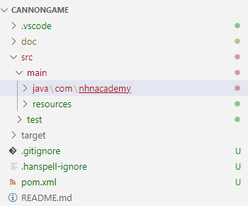

:stem: latexmath

= 1. 준비하기

== 1-1. 목적

* Java 언어 학습 과정에서 배운 내용 복습
* 소프트웨어 개발시 고려해야할 다양한 지식 습득
* 프로그래밍 연습

== 1-2. 학습 범위

* Java 프로그래밍 연습
** Java 언어 기초
** data abstraction
** class vs interface
** inheritance
* Java graphics
** awt swing
* event-driven programming
* testing
** JUnit
* logging
** Log4J2
* clean code
** coding convention
** varidity check

== 1-3. 참고

=== 1-3-1. 라이브러리

프로젝트를 생성하고, 실습에 필요한 라이브러리는 다음과 같다.

* https://logging.apache.org/log4j/2.x/index.html[Log4J2]
** 로그 출력 및 관리
** 버전
*** log4j-api-2.20.0.jar 이상
*** log4j-core-2.20.0.jar 이상
** 설정 파일
*** link:../src/main/resources/log4j2.xml[log4j2.xml]

* https://junit.org/junit5/[JUnit5]
** 단위 테스트
** 버전
*** junit-jupiter-api-5.9.3.jar 이상
*** Junit-platform-console-standalone-1.9.3.jar 이상

=== 1-3-2. Project Package 구성

* src/main/java/com/nhnacademy/ - com.nhnacademy
* src/test/ - test code
* src/main/java/com/nhnacademy/example/ - example code
 

==== 1-3-3. 도움 자료

* 자바 기초
** https://docs.oracle.com/javase/tutorial/java/[The Java Tutorials]
* 코딩 스타일
** https://google.github.io/styleguide/javaguide.html[Google Java Style Guide]
** https://code.visualstudio.com/docs/java/java-linting#_checkstyle[Checkstyle in Visual Studio Code]

* 단위 테스트
** https://junit.org/junit5/docs/current/user-guide/#overview-getting-started[JUnit5 User Guide]
* 로그 관리
** https://logging.apache.org/log4j/2.x/manual/api.html[Log4J 2 API]
* VSCode 설정
** https://code.visualstudio.com/docs/java/java-testing)[Testing Java with Visual Studio Code]

---

link:./index.adoc[돌아가기]