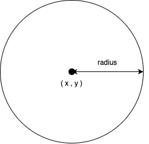
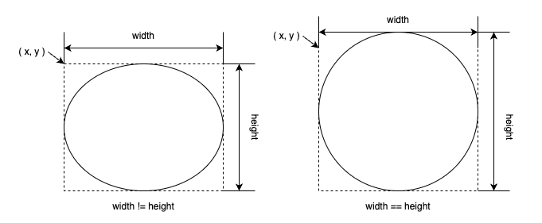
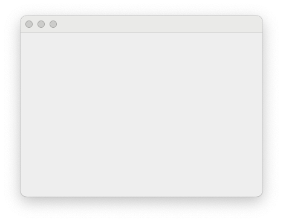
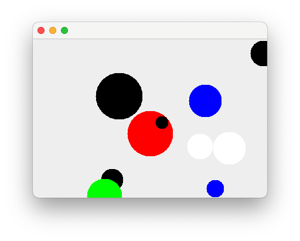

:stem: latexmath

= 2. Ball World

**Keyword**

* awt(Abstract Window Toolkit) / swing
* accessor / mutator

== 2-1. Ball

=== 정의

* ball world를 구성하는 기본 요소
** 2차원 평면에서 ball을 설명할 수 있는 최소 정보
** 위치
** 크기
* 생성 후 정보 변경 불가

{empty} +

==== Variable(변수)

* int x
** 2차원 평면에서의 X축 상 위치
** 생성 시 지정
* int y
** 2차원 평면에서의 Y축 상 위치
** 생성 시 지정
* int radius
** 볼의 중심에서 외곽까지의 길이
** 생성 시 지정

{empty} +

==== Method(함수)

* int getX()
** 볼의 X 좌표 얻기
* int getY()
** 볼의 Y 좌표 얻기
* int getRadius()
** 볼의 중심에서 외곽까지의 길이를 나타내는 반지름 얻기

{empty} +

=== Reference. Accessor와 Mutator

* Accessor
** 변수값 반환
*** private 변수에 대한 접근 지원
*** 외부에서 직접적인 접근이 필요한 경우에만 정의
** 형식
*** get + <field name>
**** getRadius, getColor, ...
*** is + <field name>
*** isEnabled, isInterrupted, ...
** 다른 용어
*** Getter

* Mutator
** 변수값 변경
*** private 변수에 대한 변경 지원
*** 외부에서 직접적인 변경이 필요한 경우에만 지원
** 형식
*** set + <field name>
*** setRadius, setColor, ...
** Setter
* **accessor와 mutator 정의 최소한으로...**

---

=== Exam-2-1-1. Ball class를 구현하라

* x, y로 이루어진 중심점 좌표, 반지름을 갖는다.
* 중심점 좌표와 반지름은 생성할 때 설정한다.
* 각 변수의 값을 요청할 수 있다.
** x, y, radius
* **코딩 규칙을 따라 작성**한다.
** VSCode 또는 IntelliJ에 SonarLint와 CheckStyle을 설치하여 확인한다. 
* class Ball를 참고하라
+
[source,java]
----
package com.nhnacademy;

public class Ball {
        ...

    public Ball(int x, int y, int radius) {
        ...
    }

    public int getX() {
        ...
    }

    public int getY() {
        ...
    }

    public int getRadius() {
        ...
    }
}
----

{empty} +

==== 확인

* Source Cdoe
** link:./example/chapter02/src/main/java/com/nhnacademy/exam020101/Main.java[Main]
** link:./example/chapter02/src/main/java/com/nhnacademy/exam020101/Ball.java[class Ball]
* 물음
** Ball이 요구대로 정의 되었나?
*** 생성시 주어진 값을 저장하고, 반환되는가?
** Ball 생성시 입력값이 올바른지 확인했나?
*** 좌표 x,y의 허용 범위는?
*** 반지름 radius의 허용 범위는?

{empty} +

---

=== Exam-2-1-2. Ball class를 구현하라

* 입력되는 argument들이 유효한지 검사하도록 수정하라.
** x, y는 int 범위에서 지정할 수 있다.
** ball의 어떠한 부분도 Java의 int 범위내에 위치해야 한다.
** 반지름은 0보다 큰 정수를 갖는다.

{empty} +

==== 확인

* Source Code
** link:../example/chapter02/src/main/java/com/nhnacademy/exam020102/Main.java[Main]
** link:../example/chapter02/src/main/java/com/nhnacademy/exam020102/Ball.java[class Ball]
* 물음
** 실행시 모든 과정에서 문제 없이 수행되었나?
** 입력 매개변수의 검증에 문제가 없나?

{empty} +

--- 

=== Exam-2-1-3. JUnit을 이용해 테스트 코드를 작성하여 확인해 보라.

** https://junit.org/junit5/docs/current/user-guide/#overview-getting-started[JUnit5 User Guide]
** 동일한 기능 확인을 N번 반복해서 실행하도록 가능하다.
*** https://junit.org/junit5/docs/current/user-guide/#writing-tests-repeated-tests[@RepeatedTest] 
*** https://junit.org/junit5/docs/current/api/org.junit.jupiter.api/org/junit/jupiter/api/RepetitionInfo.html[RepetitionInfo]

{empty} +

==== 확인

* Test Code
** link:../example/chapter02/src/test/java/exam020103/TestBall.java[TestBall]
* 물음
** 실행 코드를 이용한 확인과 테스트 코드를 이용한 확인의 차이점은?
** 어느 것이 좋은가?

== 2-2. PaintableBall

=== 정의

* 색을 가지며 화면에 그려진다.
** 생성시 주어질 수 있으며,
** 색 변경 불가

{empty} +

==== Variable

* Color color
** 볼 색상
** 생성할 때 생략 가능
** 생략 시 
*** 기본값으로 검은색(BLACK)

{empty} +

==== Method

* Color getColor()
** 볼의 색 얻기

{empty} +

=== Reference. Java Graphics

* 화면에 그리기는 Java에서 제공하는 라이브러리를 사용하므로, 요구하는 형식에 맞춰 구성
* Java AWT
** awt에서는 component를 다시 그려야 하는 시점에 paint 함수를 호출
** paint함수 호출과 함께 graphic context를 이용해 그리기 가능
* Ball class에는 ball을 화면상에 표시하기 위한 함수 필요
** void paint(Graphics g)
*** g - ball을 화면에 출력할 수 있도록 지원하는 graphic context의 instance
* awt에서 원을 그리기 위해서는 fillOval 사용
** 원을 그리기 위한 별도의 방법을 제공하지 않고 타원 그리기 방법 이용
** 원은 폭과 높이가 같은 타원
+

---

=== Exam-2-2-1. PaintableBall class를 정의하고, 화면에 출력되는지 확인하라. [[exam-2-2-1]]

{empty} +

* **Ball을 확장**한 PaintableBall 정의
* awt graphics context를 매개변수로 받아 그릴 수 있도록 paint함수 정의
** void paint(Graphics g);
* 도형의 색은 graphics context에서 설정
** setColor(Color color);
* 외부의 자원을 활용할 경우, 자원 활용 후 해당 자원의 변경된 상태 유지가 목적이 아니라면 활용 전 상태로 돌려둘 것
* **코드 중복 최소화**
** 함수에 대한 중복 정의는 권장
** 동일한 코드의 반복은 최소화

{empty} +

==== 확인

* Source Code
** link:../example/chapter02/src/main/java/com/nhnacademy/exam020201/Main.java[Main]
*** JFrame을 이용해 Frame 구성 실행
** link:../example/chapter02/src/main/java/com/nhnacademy/exam020201/PaintableBall.java[class PaintableBall]
* 물음
** PaintableBall의 constructor에서 super class의 변수들은 어떻게 초기화 하였나?
** paint 함수에서 x, y, radius, color를 가져올 때, 어떻게 처리하였나?
** graphic context를 이용해 ball 색을 출력하고, 원래 설정된 색으로 돌려놓았는가?

---

=== Exam-2-2-2. PaintableBall class를 JUnit test code를 이용해 확인하라.

{empty} +

* Test code를 사용할 경우, 화면 출력 검증이 어려워 해당 기능을 대신할 것이 필요
* Graphics를 검증 가능한 형태인 DummyGraphics를 정의하여 사용
* Graphics를 확장해서 만든 DummyGraphics를 이용해 해당 함수가 정상적으로 동작하는지 확인 

{empty} +

==== class DummyGraphics

* Variable
** color
** fillOval 호출 시 주어진 argument

{empty} +

* Method
** void setColor(Color color)
*** 색을 설정하는 함수로, PaintableBall에서 설정한 값을 저장하도록 구성한다.
** Color getColor()
*** 현재 설정된 색을 반환한다.
** Color getColorHistory()
*** 현재 색 이전에 설정되었던 색들을 저장한다.
** Color[] clearColorHistory()
*** 저장되어 있는 색 변경 정보를 삭제한다.
** Map<String, Object> getFillOvalParam();
*** fillOval을 호출하면서 사용된 인수를 저장 후 반환한다.
*** fillOval이 호출되지 않았다면, exception이 발생한다.
*** Map<String, Object>를 반환한다.
*** Map에는 x, y, width, height, color가 저장된다.

{empty} +

==== 확인

* Test Code
** link:./example/chapter02/src/test/java/com/nhnacademy/exam020202/TestPaintableBall.java[TestPaintableBall]
** link:./example/chapter02/src/test/java/com/nhnacademy/exam020202/DummyGraphics.java[class DummyGraphics]
* 물음
** 이 방법에 대한 장점과 단점은?

{empty} +

--- 

=== Exam-2-2-3. Color를 지정하지 않을 경우, 기본 값을 사용하도록 수정하라.

* Java에서 constant 정의하는 법 확인
* **코드의 중복 최소화**

{empty} +

==== 확인

* Source Code
** link:./example/chapter02/src/main/java/com/nhnacademy/exam020203/Main.java[Main]
*** Color를 지정하지 않고 생성
*** 생성 후 getColor를 이용해 확인
** link:./example/chapter02/src/main/java/com/nhnacademy/exam020203/PaintableBall.java[class PaintableBall]
*** **Constructor overloading**

== 2-3. World

=== 정의

* ball이 존재할 공간이면서 화면에 출력될 영역
** world내에서 동작할 ball은 world에서 관리
*** 볼 추가
*** 볼 삭제
**** 삭제할 볼을 주거나 인덱스로 지시
*** 특정 번째 볼 가져오기
*** 볼 갯수
*** 그리기
* Swing component
** JPanel 확장
** 전체 프로그램의 틀이 될 JFrame 생성 후 world 추가하여 실행
 
{empty} + 

==== Variable

* List<Ball> ballList
** ball 관리
** https://en.wikipedia.org/wiki/List_(abstract_data_type)[List(abstract data type)]

{empty} + 

==== Method

* void add(Ball ball)
** ball을 관리 목록에 추가
** ball - 추가할 ball
* void remove(Ball ball)
** ball을 관리 목록에서 제거
** ball - 제거할 ball
* void remove(int index)
** 특정 번째 ball 제거하기
** index - 제거할 ball 위치
* int getCount()
** ball 개수
* Ball get(int index)
** 특정 번째 ball 가져오기
** index - 가져올 ball 위치
* void paint(Graphics g)
** 화면 출력
** JPanel의 정의된 **void paint(Graphics g) 재정의**
** Panel을 **다시 그려야 하는 시점**에 ball 출력
** Ball 종류 확인 필요
** g - 화면 출력을 위한 graphic context

---

=== Exam-2-3-1. World class를 구현하라[[exam-2-3-1]]

* JPanel을 확장하여 World class 정의
* World에서 정의하고 있는 method 구현

{empty} + 

==== 확인

* Source Code
** link:./example/chapter02/src/main/java/com/nhnacademy/exam020301/Main.java[Main]
*** 실행 후 아무런 그림이 없는 window 실행
*** JFrame을 이용한 Window를 생성하여 출력
**** setSize(int, int)
***** Window 크기를 설정한다.
**** setDefaultCloseOperation(int)
***** window close 버튼을 클릭하였을때, 프로그램 종료
**** add(Component)
***** world는 JPanel을 확장하여 정의하였으므로, awt component
***** frame에서 관리하는 component로 추가
**** setEnabled(boolean)
***** Component class에 정의된 함수로서, component 사용 여부 설정
***** 기본값 false
**** setVisible(boolean)
***** Component의 화면 출력 여부
***** visible 설정 필요
***** 기본값 false
** link:./example/chapter02/src/main/java/com/nhnacademy/exam020301/World.java[class World]
*** Ball 관리
*** Frame이 다시 그려져야 하는 시점에 paint 함수 호출됨

---

=== Exam-2-3-2. 구현된 world에 paintable ball을 추가해 출력하라

* world
** 크기 가로 400, 세로 300
** 볼이 추가될때 마다 로그 출력
** Frame에서 화면을 그려야 하는 시점에 호출되는 paint 함수 추가 필요
* paintable ball
** 10개 생성하여 추가
** world 내 임의 위치
** 반지름 최소 10, 최대 50으로 제한
** 다섯 가지 색 중 하나
*** BLUE, RED, WHITE, BLACK, GREEN
* 주의할 점
** 지금까지 정의한 ball은 두 종류
** World에는 Ball type 등록 가능

{empty} +

==== 확인

* Source Code
** link:./example/chapter02/src/main/java/com/nhnacademy/exam020302/Main.java[Main]
** 로그 출력
+
[source,console]
----
2024-01-27T20:30:38.137+0900 TRACE ball 추가 :  149,   31,   22, java.awt.Color[r=0,g=255,b=0]
2024-01-27T20:30:38.140+0900 TRACE ball 추가 :  346,  205,   35, java.awt.Color[r=0,g=0,b=0]
2024-01-27T20:30:38.140+0900 TRACE ball 추가 :  118,  136,   47, java.awt.Color[r=255,g=0,b=0]
2024-01-27T20:30:38.141+0900 TRACE ball 추가 :   72,   42,   30, java.awt.Color[r=0,g=0,b=255]
2024-01-27T20:30:38.141+0900 TRACE ball 추가 :   57,  101,   25, java.awt.Color[r=0,g=0,b=255]
2024-01-27T20:30:38.141+0900 TRACE ball 추가 :  223,   95,   35, java.awt.Color[r=255,g=0,b=0]
2024-01-27T20:30:38.142+0900 TRACE ball 추가 :  150,   96,   47, java.awt.Color[r=0,g=0,b=255]
2024-01-27T20:30:38.142+0900 TRACE ball 추가 :  178,  240,   45, java.awt.Color[r=255,g=0,b=0]
2024-01-27T20:30:38.142+0900 TRACE ball 추가 :  185,  135,   41, java.awt.Color[r=255,g=0,b=0]
2024-01-27T20:30:38.143+0900 TRACE ball 추가 :   78,  158,   27, java.awt.Color[r=0,g=255,b=0]
----
*** 출력 형식은 일부 다를 수 있음

---

=== Exam-2-3-3. 추가되는 ball이 World의 영역을 벗어날 경우 exception을 발생시키고 새롭게 생성하라.

* World에서 ball 추가시 ball의 모든 부분이 world의 영역 내에 포함되는지 확인
* 그렇지 않으면, IllegalArgumentException 발생
* 주의
** World의 크기만 준다고 화면상에 크기가 표시되지 않음.
** 화면상에 표시되는 기본 틀은 Frame에 따른다. 따라서, Frame의 크기를 설정하기 않으면 실행 후 타이틀 바만 보임.

{empty}+

==== 확인

* Source Code
** link:./example/chapter02/src/main/java/com/nhnacademy/exam020303/Main.java[Main]
*** exception의 발생 원인이 외부에서 주어진 데이터 잘못이므로, 외부에서 처리하도록 함.
** link:./example/chapter02/src/main/java/com/nhnacademy/exam020303/World.java[class World]
*** Ball 추가 시점에 영역이 벗어나는지 확인
*** 영역을 벗어난 ball을 등록할 경우, world에서는 exception을 발생시킴