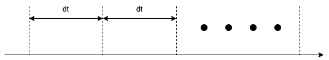
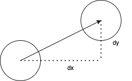

:stem: latexmath

= 3. Movable Ball World

Ball과 World를 만들어 보았다. 하지만, 단순히 다양한 모양의 ball을 그려주는 과정만 수행하였다. 이제는 ball을 이동시키며 이와 관련된 여러 가지 것들을 알아보도록 하자

ball의 이동은 시간이 변화함에 따라 위치가 변화함을 말한다.

공간에서 ball의 이동을 나타내기 위해서는 단위 시간과 단위 시간 동안의 이동 거리가 있어야 한다.

단위 시간 dt는 화면을 구성하는 시간 간격 또는 행위를 수행할 의미 있는 단위 시간으로  Ball이나 World에서는 Ball을 이동시키고 화면을 출력하는 과정이 될 것이다.

== 3-1. MovableBall

=== 정의

* world에서 이동시킬 수 있다.
** 특정 위치로 옮길 수 있다.
** 단위 시간 동안 일정 거리만큼 이동할 수 있다.
* 변화량을 가진다.
** 이동 명령(move)에 따라 지정된 변화량만큼 이동한다.

* 변화량은 변경할 수 있다.

{empty} +

==== Variable

* int dx
** 단위 시간 동안의 x축 이동량을 나타내는 변위량
* int dy
** 단위 시간 동안의 y축 이동량을 나타내는 변위량

{empty} +

==== Method
 
* int getDX()
** 단위 시간당 x축으로 이동량 가져오기
* int getDY()
** 단위 시간당 y축으로 이동량 가져오기
* void setDX(int dx)
** 단위 시간당 x축으로 이동량 설정
* void setDY(int dy)
** 단위 시간당 y축으로 이동량 설정
* void move()
** 단위 시간만큼 이동시키기
* void moveTo(int x, int y)
** 특정 위치로 옮기기

---

=== Exam-3-1-1. MovableBall class를 구현하라.[[Exam-3-1-1]]

* PaintableBall class에서 확장
** 단위 시간동안 이동할 변위량 저장을 위한 변수들 추가
** 변위량 확인 또는 변경을 위한 함수 추가
** 단위 시간만큼 이동을 위한 함수 추가
** 특정 위치로 이동할 수 있도록 함수 추가
*** super class의 variable 변경은 method 이용(없을 경우 추가)
* World에 추가
* 반드시 필요하지 않은 변수나 함수는 정의하지 않는다.

{empty} +

==== 확인

* Source Code
** link:./example/chapter03/src/main/java/com/nhnacademy/example030101/Main.java[Main]
*** 볼이 보이나?
**** 보일 수도 보이지 않을 수도 있다.
*** 볼이 이동하는가?
**** 이동을 확인하려면?
** link:./example/chapter03/src/main/java/com/nhnacademy/example030101/MovableBall.java[class MovableBall]

---

=== Exam-3-1-2. MovableBall class를 JUnit을 이용해 확인하라.[[Exam-3-1-2]]

* 화면 출력없이 확인
* PaintableBall에서 확장 후 추가되거나 변경된 기능에 대해서만 테스트
* 다양한 테스트 방법을 적용 해보자.
** @Test
** @RepeatedTest
** @ParameterizedTest

{empty} +

==== 확인

* Source Code
** link:./example/chapter03/src/test/java/com/nhnacademy/exam030102/TestMovableBall.java[Test MovableBall]
*** 이동에 문제가 없나?
*** <<Exam-3-1-1>>과 어떠한 차이가 있나?
*** 동일한 테스트 과정을 여러 방법으로 구현해 보았다. 차이와 장단점은?

== 3-2. MovableWorld class

=== 정의

* <<Exam-3-1-1>>과 <<Exam-3-1-2>>에서는 world에 등록했지만, main에서 ball을 이동 시킴
* world에서 ball을 이동 시킴
* 일정 횟수만 이동하는 유한 이동 또는 무한 이동

{empty} +

==== Variable

* int moveCount
** 실행하는 동안 이동 횟수
* maxMoveCount
** 최대 이동 횟수

{empty} +

==== Method

* void reset()
** 이동 횟수(moveCount) 초기화
** maxMoveCount는 변경 없음
* void move()
** 단위 시간 단위 이동
** 호출 시 등록된 볼 중에서 이동할 수 있는 MovableBall만 1회 이동
** 이동 후 화면 다시 그리기
*** AWT에서는 다시  그리기 위한 repaint 함수 지원
** 이동 횟수 저장
** 최대 이동 횟수를 넘지는 않음
* void run()
** 지정한 횟수 동안 ball 이동
** 최대 이동 횟수가 0이면, 계속 이동
* int getMovementCount()
** 이동 횟수 반환
* int getMaxMoveCount()
** 최대 이동 횟수 반환
* void setMaxMoveCount(int count)
** 최대 이동 횟수 설정

---

=== Exam-3-2-1. MovableWorld class를 구현하라[[exam-3-2-1]]

* MovableWorld
** World class 확장
** World class의 변수를 직접 접근해야 할 경우, gettter 추가 후 이용
* ball
** 10개 생성
** 시작 위치 window 내로 제한
** 크기는 반지름 10~50 사이
** 변화량은 x축 또는 y축으로 10에서 30
** ball 간 중첩 허용
* Window
** 크기는 가로 400, 세로 300

{empty} +

==== 확인

* Source Code
** link:./example/chapter03/src/main/java/com/nhnacademy/example030201/Main.java[Main]
** link:./example/chapter03/src/main/java/com/nhnacademy/example030201/MovableWorld.java[class MovableWorld]
*** 이동 횟수가 적을 경우
+
image::./image/figure08.png[title="이동 횟수 적음",align=center]
*** 이동 횟수가 조금 늘린 경우
+
image::./image/figure09.png"[title="이동 횟수 중간",align=center]
*** 이동 횟수가 많은 경우
+
image::./image/figure10.png"[title="이동 횟수 많음",align=center]
* MovableWorld에서는 ball이 이동해야 한다. ball이 이동하는가?
** 무엇이 문제일까?
** link:./example/chapter03/src/main/java/com/nhnacademy/example030201/MovableBall.java[class MovableBall]

---

== 3-3. ball의 이동 시간

* MovableWorld는 아래 그림과 같이  stem:[dt] 간격마다 ball을 이동시킴
+
image::./image/figure11.png"[title="Zero DT",align=center]
* 앞에서 구현한 MovableWorld에서는 단위 시간 stem:[dt]에 대해 정의하지 않아 시간에 따른 변화를 볼 수 없음
* stem:[dt]가 아주 작은 값을 주거나 0이라면 결과는 어떻게 될까?

---

=== Exam-3-3-1. 다음 코드는 MovableBall을 수정하여 로그를 추가하여 ball 이동이 보이지 않는 문제에 관해 확인해 보자

* MovableBall의 move 함수 실행시 로그 출력
* Ball 구분을 위한 id와 name 추가
** id는 생성되는 ball에 유일한 값으로 부여되어야 함
** name은 기본으로 id를 갖고, 설정으로 변경 가능

{empty} +

==== 확인

* Source Code
** link:./example/chapter03/src/main/java/com/nhnacademy/exam030301/Ball.java[class Ball]
*** id 추가
**** 생성시 id 자동 부여 또는 설정
*** name 추가
**** 기본 값으로 id
*** logger 추가
**** Ball의 상태 정보 등
** link:./example/chapter03/src/main/java/com/nhnacademy/exam030301/MovableBall.java[class MovableBall]
*** move함수 수행시 로그 출력
** link:./example/chapter03/src/main/java/com/nhnacademy/exam030301/Main.java[Main]
*** Ball 이름 설정
* 로그
+
[source,console]
----
2024-01-28T00:07:41.786+0900 TRACE ball_05 move to : x = 333, y = 102
2024-01-28T00:07:41.786+0900 TRACE ball_06 move to : x = 418, y = 101
2024-01-28T00:07:41.786+0900 TRACE ball_07 move to : x = 126, y = 184
2024-01-28T00:07:41.786+0900 TRACE ball_08 move to : x = 118, y = 181
2024-01-28T00:07:41.787+0900 TRACE ball_09 move to : x = 94, y = 262
2024-01-28T00:07:41.787+0900 TRACE ball_10 move to : x = 137, y = 179
2024-01-28T00:07:41.787+0900 TRACE ball_01 move to : x = 312, y = 301
2024-01-28T00:07:41.787+0900 TRACE ball_02 move to : x = 195, y = 244
2024-01-28T00:07:41.788+0900 TRACE ball_03 move to : x = 197, y = 231
2024-01-28T00:07:41.788+0900 TRACE ball_04 move to : x = 419, y = 198
2024-01-28T00:07:41.788+0900 TRACE ball_05 move to : x = 354, y = 120
2024-01-28T00:07:41.789+0900 TRACE ball_06 move to : x = 436, y = 114
----
** 각 라인은 볼이 이동될때마다 시간과 ball의 위치를 표시
** 시간은 밀리초(milliseconds) 단위로 표시
* 물음
** ball의 이동 속도는 어떻게 되나?
** 움직이는 볼은 보일 수도 있고, 보이지 않을 수도 있다. 이를 항상 보이게 하려면 어떻게 해야할까?

---

=== 단위시간 stem:[dt]

단위 시간을 추가해 보자.

단위 시간은 ball의 이동 간격 사이 일정 시간 기다림으로 구현할 수 있으며, Thread.sleep()을 이용해 밀리초 단위로 설정할 수 있다

{empty} +

==== Variable

* int dt
** 단위 시간 저장을 위한 필드를 추가한다

{empty} +

==== Method

* void setDT(int dt)
** 단위 시간 설정
* int getDT()
** 설정되어 있는 단위 시간
* void run()
**  함수 수정
** move 후 지정된 단위 시간만큼 대기

---

=== Exam-3-3-2. MovableWorld class에 단위 시간을 추가하라

* move 함수가 호출된 후 설정된 단위 시간만큼 대기한다.
** 대기는 Tread.sleep 사용

==== 확인

* link:./example/chapter03/src/main/java/com/nhnacademy/exam030302/MovableWorld.java[class MovableWorld]
+
[source,console]
----
2024-01-28T07:58:34.337+0900 TRACE ball 추가 :   55,   87,   10, java.awt.Color[r=0,g=0,b=0]
2024-01-28T07:58:34.417+0900 TRACE start
2024-01-28T07:58:34.427+0900 TRACE ball_01 move to : x = 65, y = 102
2024-01-28T07:58:34.541+0900 TRACE ball_01 move to : x = 75, y = 117
2024-01-28T07:58:34.648+0900 TRACE ball_01 move to : x = 85, y = 132
2024-01-28T07:58:34.754+0900 TRACE ball_01 move to : x = 95, y = 147
...
2024-01-28T07:58:44.812+0900 TRACE ball_01 move to : x = 1035, y = 1557
2024-01-28T07:58:44.920+0900 TRACE ball_01 move to : x = 1045, y = 1572
2024-01-28T07:58:45.026+0900 TRACE ball_01 move to : x = 1055, y = 1587
2024-01-28T07:58:45.134+0900 TRACE finished : 10715
----
** 100회 이동하는 동안 10,715ms 소모
** 단위 시간을 100ms로 설정하였기에 계산상으로는 10,000ms 소모되어야 정상
*** move 1회 호출 후 무조건 100ms 대기(마지막도 동일함)
* 물음
** 로그로 출력된 소요 시간이 10,715ms인 이유는?
** Thread.sleep을 사용하면, try/catch나 throws를 통해 exception 처리를 요청한다. 왜 그럴까?
*** https://www.baeldung.com/java-exceptions[Exception handling in Java]
*** https://www.baeldung.com/java-interrupted-exception[How to Handle InterruptedException in Java]

---

=== 시간 오차의 원인

Thread.sleep를 이용해 일정 시간 대기를 걸어 이동간 일정 시간 간격을 주었다. 하지만, 결과는 원하는 시간 이상의 간격이 발생한다.

수행 시간은 다음 그림과 같다.

move 간 단위 시간(stem:[dt])을 줄 경우 실제 수행시간은 stem:[T=dt * n]이 아니다.

이는 move 처리시간을 감안하지 않을 것으로서 실제 수행 시간은 stem:[T = (\alpha + dt) * n] 가 된다.

image::./image/figure12.png"[title="단위시간 오차",align=center]

---

=== Exam-3-3-3. MovableWorld에서 move 후 변경되는 시간의 오차를 최소화하라

단위 시간 오차의 해결을 위해서는 move 수행한 후 다음 move 호출 전까지의 대기 시간을 단위 시간이 아닌 호출 시간으로 하면 된다.

다시 말해, move와 다시 그리기 등의 추가 작업을 위해 1ms를 소비했다고 한다면, 다음 move를 위해 대기 시간은 단위 시간(stem[dt]) - 1이 되어야 할 것이다.

move 시간을 고려한 단위 시간을 나타낸 것이다.

image::./image/figure13.png"[title="단위시간 오차 보정",align=center]

{empty} +

==== 확인

* Source Code
** link:./example/chapter03/src/main/java/com/nhnacademy/exam030303/MovableWorld.java[class MovableWorld]
*** 시간은 단순히 sleep하지 않고
*** 다음번 수행될 시간을 계산한 후 sleep
+
[source,console]
----
2024-01-28T08:02:35.759+0900 TRACE ball 추가 :  155,   70,   10, java.awt.Color[r=0,g=0,b=0]
2024-01-28T08:02:35.818+0900 TRACE start
2024-01-28T08:02:35.828+0900 TRACE ball_01 move to : x = 179, y = 96
2024-01-28T08:02:35.927+0900 TRACE ball_01 move to : x = 203, y = 122
2024-01-28T08:02:36.018+0900 TRACE ball_01 move to : x = 227, y = 148
2024-01-28T08:02:36.128+0900 TRACE ball_01 move to : x = 251, y = 174
...
2024-01-28T08:02:45.518+0900 TRACE ball_01 move to : x = 2507, y = 2618
2024-01-28T08:02:45.619+0900 TRACE ball_01 move to : x = 2531, y = 2644
2024-01-28T08:02:45.719+0900 TRACE ball_01 move to : x = 2555, y = 2670
2024-01-28T08:02:45.823+0900 TRACE finished : 10001
----
** 결과는 10,001ms로 앞에서 보다는 많이 줄었다.
** 나머지 오차는 운영 체제, 단위 및 기타 연산의 영향으로 차이 날 수 있다.

---

link:./index.adoc[돌아가기]
