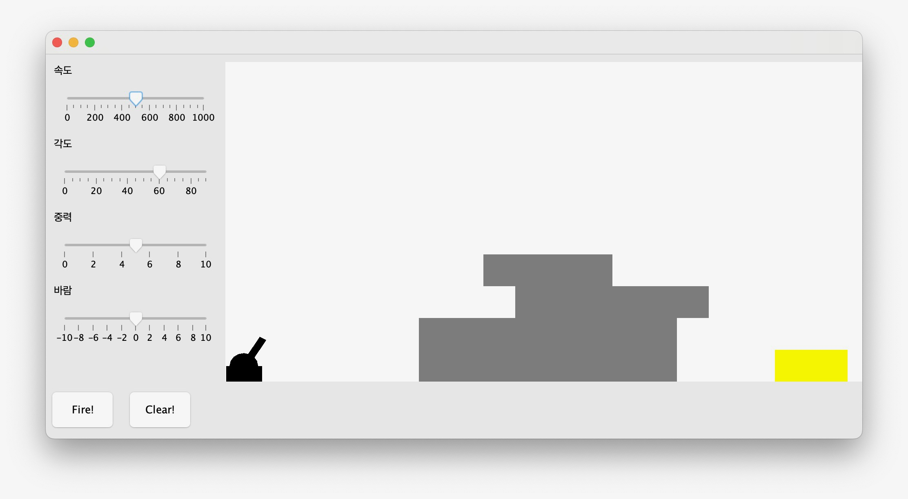

:stem: latexmath

= 11. 게임 만들기

== 11.1. 요구 사항

* 포탄을 발사하여 목표물을 맞추는 게임
+

* 게임장
** 보이지 않는 벽으로 둘러쌓여 있어, 포탄이 외부로 벗어나지 못하도록 함
** 포탄이 벽에 맞을 경우
*** 속도 감소
*** 파괴
*** 멈춤 등 다양한 형태로 구성 가능
* 포 제어
** 포탄 발사 각도/속도 조절 가능
** 각도에 따라 포가 상하로 움직을 수 있음(추가 기능)
** 속도에 따라 포의 길이가 달라질 수 있음(추가 기능)
* 외부 환경
** 날아가는 포탄에는 외부 환경의 영향 작용
** 중력(아래로 끌어 내리는 힘)
** 바람(외쪽에서 오른쪽이나 오른쪽에서 왼쪽으로 가해지는 힘)
* 장애물
** 그림에서의 회색과 같은 장애물 구성 가능
* 목표물
** 특정 위치 또는 일정 범위내에서 자유롭게 생성
** 포탄을 맞으면 파괴됨
** 목표물이 파괴대면 새로운 위치에 새로운 목표물 생성(추가 기능)
* 반사 계수 적용
** 공간을 차지하는 모든 구성 요소들은 반사 계수를 가짐
** 두종류의 물체가 충돌할 경우, 물체들의 반사 계수 곱으로 처리

== 11.2. 구성요소 만들기

=== 11.2.1. 영역을 갖는 요소

* 요소들은 일정 영역을 차지함
* 중심 위치를 갖고, 폭과 높이의 크기를 가짐
* 어떠한 힘에 의해 이동 가능
* 요소들간 충돌이 가능하며,
* 충돌시 반사를 위한 일정한 상수를 가짐

=== 11.2.2. 그려지는 요소

* 요소중 일부는 그려짐
* 그려짐은 Graphics context가 주어질 때만 가능

=== 11.2.3. 움직이는 요소

* 요소 중 일부는 움직임
* 움직임을 위한 방향이 있는 힘을 가지고,
* 단위 시간마다 움직일 수 있으며,
* 방향이나 힘의 변경도 가능

=== 11.2.4. 튕겨지는 요소

* 요소 중 일부는 다른 요소와 충돌 후 반사됨

== 11.3. 공간 만들기

=== 11.3.1. 기본 공간

* 요소들을 가지며,
* Graphics context가 주어지면, 요소들이 그려질 수 있도록 지원함

=== 11.3.2. 움지이는 공간

* 공간에 존재하는 요소를 단위시간마다 이동 시킴
* 이동 가능한 요소만 이동
* 단위 시간의 변경이 가능하고,
* 바람, 중력등 외부 영향 힘이 존재함

=== 11.3.3. 충돌하는 공간

* 구성 요소들간 충돌할 수 있는 공간
* 요소를 이동시키고 다른 요소와 충돌시 요소마다 정해진 규칙에 따라 추가 기능을 수행 시킴

=== 11.3.4. 게임 공간

* 내부 요소가 벗어날 수 없는 닫힌 공간
* 이동하지 않는 요소들의 벽으로 둘러 쌓인 공간

---

link:./00.index.adoc[돌아가기]