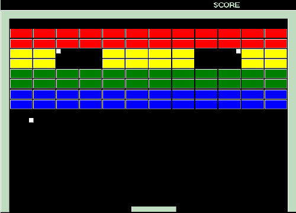

:stem: latexmath

= 12. 벽돌 깨기 게임 만들기

고전적인 게임 중 벽돌 깨기가 있다. 게임 플레이어가 발사한 볼은 공간에 튕기면서 돌아다니고, 공간 내에 존재하는 다양한 막대들은 특성에 따라 깨지거나 반사만 시키는 등 다양한 행동을 취한다.

앞서 만든 대포 게임과 다른 게임이지만 기본 동작은 동일하다.

다음은 https://www.codeproject.com/Articles/5832/Super-Brick-Breaker-A-Simple-DirectDraw-Game[Code Project]에 올라온 벽돌 깨기 게임이다.

== 요구사항

* ball
** 모든 물체에 반사된다.
** 한개 이상도 가능하다. 
*** 즉, 동시에 두개 이상의 ball 사용도 가능하며, ball간 충돌시에도 튕긴다.
** 게임당 1개 이상의 볼이 주어질 수 있다. 
*** 동시 사용과는 다르다
* 벽돌
** 단색 또는 복수의 색 사용이 가능하다.
** 종류에 따라 점수를 달리 줄 수 있다.
** 종류에 따라 강도를 정할 수 있다. 
*** 1번에 깨지는 벽돌, 3번에 깨지는 벽돌이 존재할 수 있다.
* 튕김 바
** 깨지지 않는다.
** ball을 튕길때 마다 크기가 변경될 수 있다.
** 위치에 따라 반사 각도가 달라 질 수 있다.
* 점수판
** 시작시 인원을 지정하고, 점수판은 해당 인원만큼 생성될 수 있다.

---

link:./index.adoc[돌아가기]