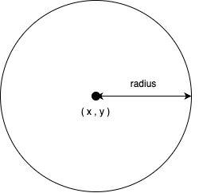
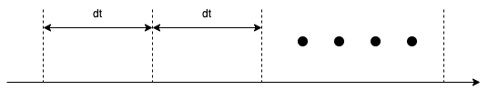
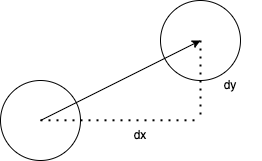

:stem: latexmath

= Cannon Game

== 1. 준비하기

=== 1-1. 목적

* Java 기초 과정에서 배운 내용을 연습하고 개발에 필요한 기본 지식 습득을 위한 연습

=== 1-2. 학습 범위

* Java 프로그래밍 연습
** Java 언어 기초
** Class vs Interface

* Event-Driven Programming
* Java Graphics
** swing
* Testing
** JUnit
* Logging
** Log4J2

=== 1-3. 참고

==== 1-3-1. 라이브러리

프로젝트를 생성하고, 실습에 필요한 라이브러리는 다음과 같다.

* https://logging.apache.org/log4j/2.x/index.html[Log4J2]
** 로그 출력 및 관리
** 버전
*** log4j-api-2.20.0.jar 이상
*** log4j-core-2.20.0.jar 이상
** 설정 파일 : link:../src/main/resources/log4j2.xml[log4j2.xml]

* https://junit.org/junit5/[JUnit5]
** 단위 테스트
** 버전
*** junit-jupiter-api-5.9.3.jar 이상
*** Junit-platform-console-standalone-1.9.3.jar 이상

==== 1-3-2. Project Package 구성

* src/main/java/com/nhnacademy/ - com.nhnacademy
* src/test/ - test code
* src/main/java/com/nhnacademy/example/ - example code
 
image::./image/figure01.png[title="프로젝트 구성", align=center]

===== 1-3-3. 도움 자료

* https://docs.oracle.com/javase/tutorial/java/[The Java Tutorials]
** 자바 기초
* https://google.github.io/styleguide/javaguide.html[Google Java Style Guide]
** 코딩 스타일
* https://junit.org/junit5/docs/current/user-guide/#overview-getting-started[JUnit5 User Guide]
** 단위 테스트
* https://logging.apache.org/log4j/2.x/manual/api.html[Log4J 2 API]
** 로그 관리
* https://code.visualstudio.com/docs/java/java-testing)[Testing Java with Visual Studio Code]
** VSCode 설정

== 2. Ball World

**Keyword**

* awt(Abstract Window Toolkit) / swing
* accessor / mutator

=== 2-1. Ball

==== 2-1-1. 정의

* ball world를 구성하는 기본 요소
* 2차원 평면에서 ball을 설명할 수 있는 최소 정보
* 생성 후 정보 변경 불가
** 위치 변경 불가

===== Variable(변수)

* int x
** 2차원 평면에서의 X축 상 위치
** 생성 시 지정
* int y
** 2차원 평면에서의 Y축 상 위치
** 생성 시 지정
* int radius
** 볼의 중심에서 외곽까지의 길이
** 생성 시 지정

===== Method(함수)

* int getX()
** 볼의 X 좌표 얻기
* int getY()
** 볼의 Y 좌표 얻기
* int getRadius()
** 볼의 중심에서 외곽까지의 길이를 나타내는 반지름 얻기

===== 참고. Accessor와 Mutator

* Accessor
** 변수값 반환
*** private 변수에 대한 접근 지원
*** 외부에서 직접적인 접근이 필요한 경우에만 정의
** 형식
*** get + <field name>
**** getRadius, getColor, ...
*** is + <field name>
*** isEnabled, isInterrupted, ...
** 다른 용어
*** Getter

* Mutator
** 변수값 변경
*** private 변수에 대한 변경 지원
*** 외부에서 직접적인 변경이 필요한 경우에만 지원
** 형식
*** set + <field name>
*** setRadius, setColor, ...
** Setter

**accessor와 mutator 정의는 최소한으로 한다**

---

==== Exam-01. Ball class를 구현하라

* x, y로 이루어진 중심점 좌표, 반지름, 색을 갖는다.
* 중심점 좌표와 반지름은 생성할 때 설정한다.
* 색은 생성할 때 지정한다.
** 색이 지정되지 않은 경우, 기본색은 검은색(BLACK)으로 지정한다.
* 각 변수의 값을 요청할 수 있다.
** x, y, radius, color
* **코드 중복은 최소화**하라.
** 함수에 대한 중복 정의는 가지만, 동일한 코드가 반복되는 것은 최소화
* **코딩 규칙을 따라 작성**한다.
** VSCode 또는 IntelliJ에 SonarLint와 CheckStyle을 설치하여 확인한다. 

**class Ball**

[source,java]
----
package com.nhnacademy;

import java.awt.Color;

public class Ball {
        ...

    public Ball(int x, int y, int radius, Color color) {
        ...
    }

    public Ball(int x, int y, int radius) {
        ...
    }

    public int getX() {
        ...
    }

    public int getY() {
        ...
    }

    public int getRadius() {
        ...
    }
}
----

===== 물음
 
* Ball이 요구대로 정의 되었나?
** 생성시 주어진 값을 저장하고, 반환되는가?
* Ball 생성시 입력값에 대해 확인했나?
** 좌표 x,y의 허용 범위는?
** 반지름 radius의 허용 범위는?

===== 결과 확인

* link:../src/test/java/com/nhnacademy/BallTest.java[BallTest.java]
** 참고 - https://junit.org/junit5/docs/current/user-guide/#overview-getting-started[JUnit5 User Guide]

===== 추가 문제

* 동일한 기능 확인을 N번 반복해서 실행해 보자.
** https://junit.org/junit5/docs/current/user-guide/#writing-tests-repeated-tests[@RepeatedTest] 
** https://junit.org/junit5/docs/current/api/org.junit.jupiter.api/org/junit/jupiter/api/RepetitionInfo.html[RepetitionInfo]
** 새롭게 정의된 constructor는 unit test를 이용해 확인해 보자.

---

=== 2-2. PaintableBall

==== 정의
** 색상 변경 불가

===== Variable

* Color color
** 볼 색상
** 생성할 때 생략 가능
** 생략 시 기본값으로 검은색(BLACK)

===== Method

* Color getColor()
** 볼의 색 얻기

===== 참고

* 화면에 그리기는 Java에서 제공하는 라이브러리를 사용하므로, 요구하는 형식에 맞춰 구성
* Java AWT
** awt에서는 component를 다시 그려야 하는 시점에 paint 함수를 호출
** paint함수 호출과 함께 graphic context를 이용해 그리기 가능
* Ball class에는 ball을 화면상에 표시하기 위한 함수 필요
** void paint(Graphics g)
*** g - ball을 화면에 출력할 수 있도록 지원하는 graphic context의 instance
* awt에서 원을 그리기 위해서는 fillOval 사용
** 원을 그리기 위한 별도의 방법을 제공하지 않고 타원 그리기 방법 이용
** 원은 폭과 높이가 같은 타원
+
image::./image/figure03.png[title="oval",align=center]

---

==== Exam-02. PaintableBall class를 정의하고, 화면에 출력되는지 확인하라. [[exam_02]]

* **Ball을 확장**한 PaintableBall을 정의하라.
* awt graphics context를 매개변수로 받아 그릴 수 있도록 함수 paint를 정의하라.
** void paint(Graphics g);
* 도형의 색은 graphics context에서 설정할 수 있다.
** setColor(Color color);
* 외부의 자원을 활용할 경우, 자원 활용 후 해당 자원의 변경된 상태 유지가 목적이 아니라면 활용 전 상태로 돌려두는 것이 좋다.

{empty} +

===== 물음

* PaintableBall의 constructor에서 super class의 constructor를 이용하였나?
* paint 함수에서 x, y, radius, color를 가져올 때, 어떻게 처리하였나?
* graphic context를 이용해 ball 색을 출력하고, 원래 설정된 색으로 돌려놓았는가?

{empty} +

===== 결과 확인

* JFrame을 이용해 Frame 구성
* link:../src/main/java/com/nhnacademy/example/Exam02.java[Exam02.java]

===== Unit Test
* DummyGraphics class를 만들어 PaintableBall 검증하기
* Graphics는 화면에 출력하기 위한 것으로 결과에 대한 검증이 어려움
* Graphics를 확장해서 만든 DummyGraphics를 이용해 해당 함수가 정상적으로 동작하는지 확인 

* link:../src/test/java/com/nhnacademy/DummyGraphics.java[DummyGraphics.java]
** 검증에 필요한 정보 저장
*** color
*** fillOval 호출 시 주어진 argument
** void setColor(Color color)
*** 색을 설정하는 함수로, PaintableBall에서 설정한 값을 저장하도록 구성한다.
** Color getColor()
*** 현재 설정된 색을 반환한다.
** Color getColorHistory()
*** 현재 색 이전에 설정되었던 색들을 저장한다.
** Color[] clearColorHistory()
*** 저장되어 있는 색 변경 정보를 삭제한다.
** Map<String, Object> getFillOvalParam();
*** fillOval을 호출하면서 사용된 인수를 저장 후 반환한다.
*** fillOval이 호출되지 않았다면, exception이 발생한다.
*** Map<String, Object>를 반환한다.
*** Map에는 x, y, width, height, color가 저장된다.
* link:../src/test/java/com/nhnacademy/PaintableBallTest.java[PaintableBallTest.java]
** DummyGraphics를 통해 동작 시키고, DummyGraphics에 남겨진 정보를 이용해 확인

===== 추가 문제

* DEFAULT_COLOR를 사용를 지정하고, color가 지정되지 않아도 ball이 생성될 수 있도록 Ball class를 수정해 보자.

---

=== 2-3. World

==== 2-3-1. 정의

* ball이 존재할 공간이면서 화면에 출력될 영역
** world내에서 동작할 ball은 world에서 관리
* JPanel component 확장
** swing component
** JFrame 생성 후 panel을 추가하여 실행시키면 화면에 출력됨

{empty} + 

===== Variable

* List<Ball> ballList
** ball 관리

{empty} + 

===== Method

* void add(Ball ball)
** ball을 관리 목록에 추가
** ball - 추가할 ball
* void remove(Ball ball)
** ball을 관리 목록에서 제거
** ball - 제거할 ball
* int getBallCount()
** ball 개수
* Ball getBall(int index)
** 특정 번째 ball 가져오기
** index - 가져올 ball 위치
* void removeBall(int index)
** 특정 번째 ball 제거하기
** index - 제거할 ball 위치
* void paint(Graphics g)
** 화면 출력
** JPanel의 정의된 **void paint(Graphics g) 재정의**
** Panel을 **다시 그려야 하는 시점**에 ball 출력
** Ball 종류 확인 필요
** g - 화면 출력을 위한 graphic context

---

==== Exam-03. World class를 구현하라[[exam_03]]

* JPanel을 확장하여 World class를 정의하라.
* World에서 정의하고 있는 method를 구현하라.

{empty} + 

===== 실행 결과

* 실행 후 아무런 그림이 없는 window 실행

image::./image/figure04.png[title="실행 결과",align=center]

* log4j2를 이용해 로그가 출력되도록 구성하였으므로, 실행할 때 다음과 같은 로그 출력

[source,console]
----
2024-01-17T23:53:32.915+0900 INFO world 생성 완료
2024-01-17T23:53:32.918+0900 INFO Frame에 추가 완료
2024-01-17T23:53:32.989+0900 INFO 화면 출력
----

* link:../src/main/java/com/nhnacademy/example/Exam03.java[Exam03.java]
** JFrame을 이용한 Window를 생성하여 출력한다.
** JFrame
*** setSize(int, int)
**** Window 크기를 설정한다.
*** addWindowListener(WindowListener)
**** window에 발생하는 이벤트를 frame에 전달한다.
**** windowClosing 설정을 통해 close 이벤트 생성할 때 System.exit(0)을 이용해 프로그램을 종료한다.
*** add(Component)
**** world는 JPanel을 확장하여 정의하였으므로, awt component이다.
**** frame에서 관리하는 component로 추가한다.
*** setEnabled(boolean)
**** Component class에 정의된 함수로서, component 사용 여부를 설정한다.
*** setVisible(boolean)
**** Component를 생성한다고 무조건 출력되지는 않는다.
**** visible 설정을 해야 하고, 기본값은 false로 출력되지 않는다.

---

World class를 정의하고, test code를 이용해 world가 생성됨을 확인하였다.

이제 개발하려는 게임의 가장 기본이 되는 world와 ball이 정의되었으므로, world를 이용해 ball을 출력해 보자.

---

==== Exam-04. world를 생성하고, ball을 추가해 출력하라

* world
** 크기는 가로 400, 세로 300으로 한다.
** 볼이 추가될때 마다 로그를 출력한다.

* ball
** 10개를 생성하여 추가한다.
** 크기는 10에서 50으로 제한한다.
** 위치는 world 내 임의 위치로 한다.
*** world를 벗어나거나 경계에 걸쳐 출력되지 않도록 한다.

** 다섯 가지 색 중 임의의 하나를 적용한다.
*** BLUE, RED, WHITE, BLACK, GREEN

* Test Code
** <<exam_03,Exam-03>>을 참고한다.

===== 실행 결과

* 다음과 같이 출력

image::./image/figure05.png[title="Exam-04",align=center]

* 로그 출력은 다음과 같다.

[source,console]
----
2024-01-18T00:07:10.276+0900 INFO world 생성 완료
2024-01-18T00:07:10.279+0900 INFO ball 추가 : 278, 209,  31, ff00ff00
2024-01-18T00:07:10.279+0900 INFO ball 추가 : 192,  74,  44, ff0000ff
2024-01-18T00:07:10.280+0900 INFO ball 추가 :  66, 290,  42, ffff0000
2024-01-18T00:07:10.280+0900 INFO ball 추가 : 194, 260,  31, ffffffff
2024-01-18T00:07:10.280+0900 INFO ball 추가 :  27, 105,  25, ffffffff
2024-01-18T00:07:10.280+0900 INFO ball 추가 : 375, 269,  49, ffffffff
2024-01-18T00:07:10.280+0900 INFO ball 추가 :  96, 289,  26, ffffffff
2024-01-18T00:07:10.280+0900 INFO ball 추가 :  97,  94,  16, ffff0000
2024-01-18T00:07:10.281+0900 INFO ball 추가 : 249,  71,  19, ff00ff00
2024-01-18T00:07:10.281+0900 INFO ball 추가 : 129, 219,  26, ff000000
2024-01-18T00:07:10.281+0900 INFO Frame에 추가 완료
2024-01-18T00:07:10.373+0900 INFO 화면 출력
----

---

== 3. Movable Ball World

Ball과 World를 만들어 보았다. 하지만, 단순히 다양한 모양의 ball을 그려주는 과정만 수행하였다. 이제는 ball을 이동시키며 이와 관련된 여러 가지 것들을 알아보도록 하자

ball의 이동은 시간이 변화함에 따라 위치가 변화함을 말한다.

공간에서 ball의 이동을 나타내기 위해서는 단위 시간과 단위 시간 동안의 이동 거리가 있어야 한다.

단위 시간 dt는 화면을 구성하는 시간 간격 또는 행위를 수행할 의미 있는 단위 시간으로  Ball이나 World에서는 Ball을 이동시키고 화면을 출력하는 과정이 될 것이다.

=== 3-1. MovableBall

==== 3-1-1. 정의

* world에서 이동시킬 수 있다.
** 특정 위치로 옮길 수 있다.
** 단위 시간 동안 일정 거리만큼 이동할 수 있다.
* 변화량을 가진다.
** 이동 명령(move)에 따라 지정된 변화량만큼 이동한다.

* 변화량은 변경할 수 있다.

===== Variable

* int dx
** 단위 시간 동안의 x축 이동량을 나타내는 변위량
* int dy
** 단위 시간 동안의 y축 이동량을 나타내는 변위량

===== Method
 
* int getDX()
** 단위 시간당 x축으로 이동량 가져오기
* int getDY()
** 단위 시간당 y축으로 이동량 가져오기
* void setDX(int dx)
** 단위 시간당 x축으로 이동량 설정
* void setDY(int dy)
** 단위 시간당 y축으로 이동량 설정
* void move()
** 단위 시간만큼 이동시키기
* void moveTo(int x, int y)
** 특정 위치로 옮기기

---

==== Exam-05. MovableBall class를 구현하라

* PaintableBall class를 확장하여 MovableBall class를 정의하고 구현하라.
** 단위 시간동안 이동할 변위량 저장을 위한 변수들 추가
** 변위량 확인 또는 변경을 위한 함수 추가
** 단위 시간만큼 이동을 위한 함수 추가
** 특정 위치로 이동할 수 있도록 함수 추가
* 반드시 필요하지 않은 변수나 함수는 정의하지 않는다.

===== 실행 결과

1. 실행 후 확인
* Test code가 성공적으로 수행되면 아래와 같은 로그가 출력된다.
+
[source,console]
----
2024-01-18T00:18:49.962+0900 INFO creation : 709, 534,  10
2024-01-18T00:18:49.964+0900 INFO set DX/DY :  18,  69
2024-01-18T00:18:49.976+0900 DEBUG 1, 1705504729964, 727, 603
2024-01-18T00:18:49.983+0900 INFO move : 727, 603
2024-01-18T00:18:49.983+0900 DEBUG 2, 1705504729983, 745, 672
2024-01-18T00:18:49.983+0900 INFO move : 745, 672
2024-01-18T00:18:49.984+0900 DEBUG 3, 1705504729984, 763, 741
2024-01-18T00:18:49.984+0900 INFO move : 763, 741
  ...
2024-01-18T00:18:50.112+0900 DEBUG 36, 1705504730112, 4185, 1350
2024-01-18T00:18:50.112+0900 INFO move : 4185, 1350
2024-01-18T00:18:50.112+0900 DEBUG 37, 1705504730112, 4278, 1376
2024-01-18T00:18:50.112+0900 INFO move : 4278, 1376
2024-01-18T00:18:50.112+0900 DEBUG 38, 1705504730112, 4371, 1402
2024-01-18T00:18:50.112+0900 INFO move : 4371, 1402
2024-01-18T00:18:50.112+0900 DEBUG 39, 1705504730112, 4464, 1428
2024-01-18T00:18:50.112+0900 INFO move : 4464, 1428
----
2. Unit Test
* link:../src/test/java/com/nhnacademy/MovableBallTest.java[MovableBallTest.java]

===== 물음

* 화면에는 이동하는 것이 보이나?
* Unit test를 할 경우, graphics의 상태 저장은 어떻게 되는가?
** closure를 고려하라.
** Pair class를 정의하고, location을 final로 생성하여 사용한다.

---

=== 3-2. MovableWorld class

==== 3-2-1. 정의

* 공간에서 ball을 단위 시간 단위로 이동시킨다
** 단위 시간 단위 이동이란?
*** 추가된 ball을 한번 이동시키는 걸 말한다.

===== Variable

* int moveCount
** 실행하는 동안 이동 횟수
* maxMoveCount
** 최대 이동 횟수

===== Method

* void reset()
** 상태를 초기화한다
** 설정한 maxMoveCount는 초기화하지 않는다.
* void move()
** 단위 시간 단위 이동
** 호출 시 등록된 볼 중에서 이동할 수 있는 MovableBall만 1회 이동시킨다
** 이동하고 나면 화면을 다시 그려야 한다.
*** AWT에서는 component를 다시  그리기 위해 repaint 함수 지원
** 이동 횟수를 저장한다.
** 최대 이동 횟수를 넘지는 않는다.
* void run()
** 지정한 횟수 또는 시간 동안 ball을 이동시킨다.
** 최대 이동 횟수가 0이면, 계속 이동한다.
* int getMoveCount()
** 이동 횟수를 반환한다.
* int getMaxMoveCount()
** 최대 이동 횟수를 반환한다.
* void setMaxMoveCount(int count)
** 최대 이동 횟수를 설정한다.

---

==== Exam-06. MovableWorld class를 구현하라

* World class의 필드를 직접 접근해야 할 경우, World class를 수정하고 직접적인 접근은 방지하라.
* Test code를 이용해 확인한다.

===== 결과 확인

* MovableWorld class를 정의하고, test code를 이용해 기본 동작을 확인해 보자.
* 실제 화면상에도 동일하게 동작하는지 확인해 보자.

===== Unit Test

* link:../src/test/com/nhnacademy/MovableWorldTest.java[MovableWorldTest.java]

---

==== Exam-07. MovableWorld class 구동을 위한 프로그램을 만들어 확인하라

* JFrame을 이용해 window를 만들고, MovableWorld를 component로 사용해 적용하라.
** Window 크기는 가로 400, 세로 300으로 한다.

* 10개의 ball을 생성하라.
** 시작 위치 window 내로 제한한다.
** 크기는 반지름 10~50 사이로 한다.
** 변화량은 가로, 세로 10에서 30 사이로 한다.
** ball 간 중첩되지 않도록 한다.
*** ball 간 중첩은 ball에서 지원하는 함수로 구현할 수 있다.

===== 실행 결과

* 이동 횟수가 적을 경우, 다음과 같이 멈춰 있다.

image::./image/figure08.png[title="이동 횟수 적음",align=center]

* 이동 횟수가 조금만 늘어도 화면에는 몇 개 보이지 않는다.

image::./image/figure09.png"[title="이동 횟수 중간",align=center]

* 이동 횟수가 조금만 많아져도 출력되는 ball은 하나도 없다.

image::./image/figure10.png"[title="이동 횟수 많음",align=center]

===== 물음

* MovableWorld에서는 ball이 이동해야 한다. ball이 이동하는가?
** 확인을 위해 코드를 일부 수정하여 ball의 위치를 확인해 보자.
+
[source,java]
----
  public class MovableBall extends Ball {
    Logger logger;
    ...
      public void move() {
          ...
          logger.debug("X : {}, Y : {}", getX(), getY());
    }
  }
----
** 출력 터미널에는 아래와 같이 출력된다.
+
[source,console]
----
18:07:22.562 [main] DEBUG exam.Exam_3_2_2 - world created
18:07:22.571 [main] DEBUG exam.Exam_3_2_2 - add ball : 331, 187, 36
18:07:22.623 [main] DEBUG MovableBall - 360, 194
18:07:22.623 [main] DEBUG MovableBall - 389, 201
18:07:22.623 [main] DEBUG MovableBall - 418, 208
18:07:22.623 [main] DEBUG MovableBall - 447, 215
18:07:22.623 [main] DEBUG MovableBall - 476, 222
18:07:22.623 [main] DEBUG MovableBall - 505, 229
18:07:22.623 [main] DEBUG MovableBall - 534, 236
18:07:22.623 [main] DEBUG MovableBall - 563, 243
18:07:22.623 [main] DEBUG MovableBall - 592, 250
18:07:22.623 [main] DEBUG MovableBall - 621, 257
----
* 무엇이 문제일까?

---

=== 3-3. ball의 이동 시간

* MovableWorld는 아래 그림과 같이  stem:[dt] 간격마다 ball을 이동시킴
+
image::./image/figure11.png"[title="Zero DT",align=center]
* 앞에서 구현한 MovableWorld에서는 단위 시간 stem:[dt]에 대해 정의하지 않아 시간에 따른 변화를 볼 수 없음
* stem:[dt]가 아주 작은 값을 주거나 0이라면 결과는 어떻게 될까?

---

==== Exam-08. 다음 코드는 MovableBall을 수정하여 ball 이동이 보이지 않는 문제에 관해 확인해 보자

MovableWorldTest에서는 dt를 설정하고 있지 않다. 
MovableBall에 로그를 추가하여 볼이 어떻게 이동하고 있는지 확인해 보자.

[source,java]
----
public class MovableBall ... {
    ...

    public void move() {
        ...
        logger.debug("{} : {}, {}, {}",
                     getMovementCount(), System.currentTimeMillis(), getX(), getY());
        }
}
----

* World class에 로그 출력을 위한 logger 추가
* 이동 횟수(movementCount)를 추가한다.
* System class에서 시스템의 현재시간을 밀리초 단위로 구할 수 있다.

**실행 로그**

[source,console]
----
----

* 각 라인은 볼이 이동될때마다 시간과 ball의 위치를 표시
* 시간은 밀리초(milliseconds) 단위로 표시

===== 물음

* ball의 이동 속도는 어떻게 되나?
* 움직이는 볼은 보일 수도 있고, 보이지 않을 수도 있다. 이를 항상 보이게 하려면 어떻게 해야할까?

---

==== 3-3-1. 단위시간 stem:[dt]

단위 시간을 추가해 보자.

단위 시간은 ball의 이동 간격 사이 일정 시간 기다림으로 구현할 수 있으며, Thread.sleep()을 이용해 밀리초 단위로 설정할 수 있다

===== Variable

* int dt
** 단위 시간 저장을 위한 필드를 추가한다

===== Method

* void setDT(int dt)
** 단위 시간 설정
* int getDT()
** 설정되어 있는 단위 시간
* void run()
**  함수 수정
** move 후 지정된 단위 시간만큼 대기

---

==== Exam-09. MovableWorld class에 단위 시간을 추가하라

* move 함수가 호출된 후 설정된 단위 시간만큼 대기한다.

===== 실행 결과

단위 시간을 추가한 후 로그 출력은 다음과 같다.

**로그 출력**

[source,console]
----
2:28:10.274 [main] DEBUG exam.Exam_3_3_2 - world created
22:28:10.285 [main] DEBUG exam.Exam_3_3_2 - add ball : 217, 281, 28, 13, -25
22:28:10.337 [main] DEBUG MovableWorld - start : 1686662890337
22:28:10.337 [main] DEBUG MovableBall - 1, 1686662890337, 230, 256
22:28:10.350 [main] DEBUG MovableBall - 2, 1686662890350, 243, 231
22:28:10.362 [main] DEBUG MovableBall - 3, 1686662890362, 256, 206
22:28:10.375 [main] DEBUG MovableBall - 4, 1686662890375, 269, 181
22:28:10.388 [main] DEBUG MovableBall - 5, 1686662890388, 282, 156
22:28:10.400 [main] DEBUG MovableBall - 6, 1686662890400, 295, 131
22:28:10.412 [main] DEBUG MovableBall - 7, 1686662890412, 308, 106
22:28:10.425 [main] DEBUG MovableBall - 8, 1686662890425, 321, 81
22:28:10.438 [main] DEBUG MovableBall - 9, 1686662890438, 334, 56
...
22:28:11.080 [main] DEBUG MovableBall - 60, 1686662891080, 997, -1219
22:28:11.093 [main] DEBUG MovableBall - 61, 1686662891093, 1010, -1244
22:28:11.106 [main] DEBUG MovableBall - 62, 1686662891106, 1023, -1269
22:28:11.119 [main] DEBUG MovableBall - 63, 1686662891119, 1036, -1294
22:28:11.132 [main] DEBUG MovableBall - 64, 1686662891132, 1049, -1319
...
22:28:11.576 [main] DEBUG MovableBall - 99, 1686662891576, 1504, -2194
22:28:11.587 [main] DEBUG MovableBall - 100, 1686662891587, 1517, -2219
22:28:11.599 [main] DEBUG MovableWorld - finished : 1686662891599 - 1262
----

* 100회 이동하는 동안 1,262밀리 초 소모
* 단위 시간을 10ms로 설정하였기에 계산상으로는 1,000ms 소모되어야 정상
** move 1회 호출 후 무조건 10ms 대기(마지막도 동일함)

===== 물음

* 로그로 출력된 소요 시간이 1,262밀리 초인 이유는?

---

수행 시간은 다음 그림과 같다.

move 간 단위 시간(stem:[dt])을 줄 경우 실제 수행시간은 stem:[T=dt * n]이 아니다.

이는 move 처리시간을 감안하지 않을 것으로서 실제 수행 시간은 stem:[T = (\alpha + dt) * n] 가 된다.

image::./image/figure12.png"[title="단위시간 오차",align=center]

---

==== Exam-10. MovableWorld에서 move 후 변경되는 시간의 오차를 최소화하라

move를 수행한 후 다음 move를 호출하기까지의 대기 시간을 단위 시간이 아닌 예정 시간까지 남은 시간으로 하면 된다.

다시 말해, move와 다시 그리기 등의 추가 작업을 위해 1ms를 소비했다고 한다면, 다음 move를 위해 대기 시간은 단위 시간 - 1이 되어야 할 것이다.

다음 그림은 실제 수행 작업을 고려한 단위 시간을 나타낸 것이다.

image::./image/figure13.png"[title="단위시간 오차 보정",align=center]

===== 실행 결과

수정한 결과가 아래와 같이 출력되는지 확인해 보자.

**로그 출력**

[source,console]
----
23:02:58.564 [main] DEBUG exam.Exam_3_3_2 - world created
23:02:58.573 [main] DEBUG exam.Exam_3_3_2 - add ball : 238, 224, 34, -27, -29
23:02:58.620 [main] DEBUG MovableWorld - start : 1686664978620
23:02:58.621 [main] DEBUG MovableBall - 1, 1686664978621, 211, 195
23:02:58.632 [main] DEBUG MovableBall - 2, 1686664978632, 184, 166
23:02:58.641 [main] DEBUG MovableBall - 3, 1686664978641, 157, 137
23:02:58.652 [main] DEBUG MovableBall - 4, 1686664978652, 130, 108
23:02:58.661 [main] DEBUG MovableBall - 5, 1686664978661, 103, 79
23:02:58.672 [main] DEBUG MovableBall - 6, 1686664978672, 76, 50
...
23:02:59.062 [main] DEBUG MovableBall - 45, 1686664979062, -977, -1081
23:02:59.072 [main] DEBUG MovableBall - 46, 1686664979072, -1004, -1110
23:02:59.083 [main] DEBUG MovableBall - 47, 1686664979083, -1031, -1139
23:02:59.091 [main] DEBUG MovableBall - 48, 1686664979091, -1058, -1168
23:02:59.102 [main] DEBUG MovableBall - 49, 1686664979102, -1085, -1197
...
23:02:59.582 [main] DEBUG MovableBall - 97, 1686664979582, -2381, -2589
23:02:59.592 [main] DEBUG MovableBall - 98, 1686664979592, -2408, -2618
23:02:59.603 [main] DEBUG MovableBall - 99, 1686664979603, -2435, -2647
23:02:59.611 [main] DEBUG MovableBall - 100, 1686664979611, -2462, -2676
23:02:59.621 [main] DEBUG MovableWorld - finished : 1686664979621 - 1001
----

결과는 1,001밀리 초로 거의 비슷한 결과를 보인다. 나머지 오차는 단위 및 기타 연산의 영향으로 차이 날 수 있다.

**물음**

* 0.999 밀리초에서 시작해 1.001 밀리초에 끝났다고 가정하자. 이 과정의 수행 시간은?

---

== 4. Bounded Ball World

**Keyword**

* Collision detection
* Bounds

ball은 시간이 흐름에 따라 지정된 방향으로 이동한다. 그리고, 정해진 공간을 벗어나더라도 이를 알지 못하고 계속 이동해 버려 결국에는 공간을 벗어나 보이지 않게 된다.

경계가 있는 세상이란 정해진 공간의 외곽에는 보이지 않는 벽으로 구성되어 있고, 벽에 ball이 부딪칠 경우 멈추거나 튕겨 나와야 한다.

사각의 경계가 있는 세상에서 ball이 벽에 부딪히는 경우는 아래 그림과 같을 것이다.

image::./image/figure14.png"[title="닫힌 공간에서의 볼",align=center]

이를 앞에서 설명한 위치 변화로 표현하면 다음과 같다.

1. 왼쪽 벽 : (dx, dy) -> (-dx, dy)
2. 아래쪽 벽 : (dx, dy) -> (dx, -dy)
3. 오른쪽 벽 : (dx, dy) -> (-dx, dy)
4. 위쪽 벽 : (dx, dy) -> (dx, -dy)

설명에 따라 ball이 벽에 부딪혔을 경우 ball이 가지고 있던 단위 변화량만 변경해서 주면 된다.

이제 결정이 필요하다. 누가 이 작업을 해줄 것인가? ball? world?

ball 스스로가 변경 작업을 해야 한다면 충돌감지를 판단할 수 있는 정보가 제공되어야 할 것이고, world가 변경 작업을 도와준다면 ball의 위치를 항상 감시해야 할 것이다.

두 가지 방법 모두 만들어 보도록 하자.

---

=== 4-1. BoundedBall class

==== 4-1-1. 정의

* 경계영역 정보를 가진다.
* 경계영역은 벽으로 막혀 있다.
* 벽에 부딪히면 튕겨 난다.
* 벽은 무한히 단단하여 부딪힌 속도로 튕겨져 나온다.

===== Variable

* Rectangle bounds
** 자신이 움직일 수 있는 영역 정보

===== Method

* Rectangle getBounds()
** 경계 영역 정보
* void setBounds(Rectangle bounds)
** 경계 영역 설정
* boolean isOutOfBounds()
** 경계를 벗어났는지 확인
* void move()
** MovableBall에서 정의된 것과 같이 이동
** 이동 후 경계 영역을 벗어난 경우, 영역 내로 들어 올 수 있도록 추가 동작 실행
* void bounce()
** 경계 영역을 벗어 난 경우, 경계 영역 내로 들어 오도록 d위치 수정

---

==== Examp-11. BoundedBall class를 구현하라

* 경계영역은 사각형으로 설정한다.
** AWT에서 Rectangle class를 지원한다.
** Rectangle class에는 두 개의 사각형이 겹쳤는지 확인하거나, 겹친 영역을 확인할 수 있는 함수가 제공된다.
** ball과 경계영역이 겹치는 것은 ball을 둘러싸는 최소한의 사각형이 경계영역과 겹치는 것이 동일하다.
** 특정한 점이 사격형을 벗어난 것은 contains 함수로도 알 수 있다.

image::./image/figure15.png"[title="exam_4_1_1_1",align=center]

* 벽에 튕기는 것은 다음의 경우로 분류된다.
** 왼쪽이나 오른쪽 벽에 부딪힐 경우, X의 이동 방향이 변경된다. 즉, X축의 변화량 stem:[dx]가 변경된다.
*** ball의 왼쪽 끝부분이 경계영역을 벗어나면 왼쪽 벽에 부딪힌 것이다.
*** ball의 오른쪽 끝부분이 경계영역을 벗어나면 오른쪽 벽에 부딪힌 것이다.
** 위쪽이나 아래쪽 벽에 부딪힐 경우, Y의 이동 방향이 변경된다. 즉, Y축의 변화량 stem:[dy]가 변경된다.
*** ball의 위쪽 끝부분이 경계영역을 벗어나면 위쪽 벽에 부딪힌 것이다.
*** ball의 아래쪽 끝부분이 경계영역을 벗어나면 아래쪽 벽에 부딪힌 것이다.

image::./image/figure16.png"[title="볼과 경계영역",align=center]

**실행 결과**

image::./image/figure17.png"[title="실행 결과",align=center]

* 경계영역을 벗어난 경우, 튕겨서 영역 안으로 들어온다.

===== 물음

* ball이 경계영역에 벗어나는 시점에 튕지 않고, 일부는 영역을 벗어났다 튕겨 들어온다. 왜 그럴까? 해결 방법은?

---

오른쪽 경계에 부딪힌 후 튕겨 난 경우는 아래 그림과 같다.

image::./image/figure18.png"[title="bounce 보정",align=center]

그림을 바탕으로 오른쪽 경계 충돌 후 이동 후 좌표를 계산하면 아래와 같다.
$$
\begin{align*}
X_R & = X_2 - r\\
x_2 &= x_1 + |d_x|\\
x_3 &= X_R - (|d_x| - (X_R - x_1))\\
    &= 2X_R - x_1 - |d_x|\\
    &= 2{(X_2 - r)} - x_1 - |d_x|\\
    &= 2{(X_2 - r)} - x_2\\
y_3 &= y_1 + dy\\
\end{align*}
$$

그림을 바탕으로 왼쪽 경계 충돌 후 이동 후 좌표를 계산하면 아래와 같다.
$$
\begin{align*}
X_L & = X_1 + r\\
x_2 & = x_1 - |d_x|\\
x_3 &= X_L + (|d_x| - (x_1 - X_L))\\
    &= 2X_L - x_1 + |d_x|\\
    &= 2{(X_1 + r)} - x_1 + |d_x|\\
    &= 2{(X_1 + r)} - (x_1 - |d_x|)\\
    &= 2{(X_1 + r)} - x_2\\
y_3 &= y_1 + d_y\\
\end{align*}
$$
그림을 바탕으로 위쪽 경계 충돌 후 이동 후 좌표를 계산하면 아래와 같다.
$$
\begin{align*}
Y_T & = Y_2 - r\\
y_2 &= y_1 + |d_y|\\
y_3 &= Y_T - (|d_y| - (Y_T - y_1))\\
    &= 2Y_T - y_1 - |d_y|\\
    &= 2{(Y_2 - r)} - y_1 - |d_y|\\
    &= 2{(Y_2 - r)} - y_2\\
x_3 &= x_1 + d_x\\
\end{align*}
$$

그림을 바탕으로 아래쪽 경계 충돌 후 이동 후 좌표를 계산하면 아래와 같다.
$$
\begin{align*}
Y_B & = Y_1 + r\\
y_2 & = y_1 - |d_y|\\
y_3 &= Y_B + (|d_y| - (y_1 - Y_B))\\
    &= 2Y_B - y_1 + |d_y|\\
    &= 2{(Y_1 + r)} - y_1 + |d_y|\\
    &= 2{(Y_1 + r)} - (y_1 - |d_y|)\\
    &= 2{(Y_1 + r)} - y_2\\
x_3 &= x_1 + d_x\\
\end{align*}
$$

---

==== Exam-12. 경계영역을 벗어나지 않도록 수정하라.

* 경계 영역을 벗어난 경우, 추가적인 처리를 통해 위치를 보정하라.
* Rectangle의 contains로 경계 검사를 할 때, 해당 점이 경계 위에 존재할 때 어떻게 처리할지 결정해야 한다.
* 위 식에서 변화량 stem:[(|d_x|, |d_y|)] 는 절댓값을 나타냄을 주의하라.(다행히 최종 계산에는 사용되지 않음)

===== 실행 결과

image::./image/figure19.png"[title="실행 결과",align=center]

* 보정식을 적용한 결과는 경계영역을 벗어나는 경우가 보이지 않는다.
* 하지만, 여전히 아래쪽으로 벗어날 수 있다. 이는 경계영역이 보이는 것보다 아래 있기 때문이다.

image::./image/figure20.png"[title="경계영역",align=center]

---

=== 4-2. BoundedWorld class

==== 4-2-1. 정의

BoundedBall class를 구현함으로써 ball을 이용한 닫힌 세상에서 움직임을 확인해 보았다. 그럼, ball이 아닌 world를 이용한 경우는 어떠한지 확인해 보자.

움직이는 ball이 주어진 공간을 벗어나는지에 대해 world에서는 지속적인 감시를 통해 알 수 있다.

또한, 현재까지 구현에서 world는 ball의 움직임을 관리하고 있으므로 더욱더 쉽게 구현할 수 있고 이를 BoundedWorld라고 하자.

BoundedWorld는 ball이 허용 공간을 벗어났는지 확인하고, 그러한 경우 적절하게 이동 방향을 변경하도록 변화량을 재설정해 주어야 한다.

===== Variable

* BoundedWorld는 자신의 공간 정보가 경계 정보가 되므로, 별도의 추가는 필요 없다.

===== Method

* BoundedWorld는 ball이 경계를 벗어났는지 확인하고, 새로운 위치를 계산해 줄 필요가 있다.

* Rectangle getBounds()
** world의 영역을 가져온다
* boolean outOfBounds(Ball ball)
** ball이 경계를 벗어났는지 확인한다
* void bounceBall(Ball ball)
** ball의 새로운 좌표를 계산하여 설정한다

---

==== Exam-13. BoundedWorld class를 구현하라

* getBounds
** World의 영역에 대한 정보로서 World class에 추가한다.
** awt component에서는 getBounds 함수를 지원하므로, 새롭게 정의할 필요는 없다.
* outOfBounds
** ball이 world를 벗어났는지 확인한다.
** BoundedWorld 영역과 ball 영역의 중첩 영역을 구해 ball 영역과 다를 경우 벗어난 것으로 판단한다.
* bounceBall
** ball이 경계영역 벽에 부딪혔을 때 튕겨 나온 위치로 이동시킨다.
** MovableBall만 해당한다.
** BoundedBall의  bounce를 참고한다.
* move
** ball을 이동시키고, 충돌 검사를 해야 하므로 기능 변경이 필요하다

===== 실행 결과

* MovableWorld를 BoundedWorld로 변경
* BoundedBall를 MovableBall로 변경하고, bounds 설정 변경

---

=== 4-3. 물체 간 충돌

**Keyword**

* Collision detection
* Bounds

BoundedBall은 경계영역을 설정하고 해당 영역을 벗어날 경우, 튕겨져 나온다.

그럼, ball이 하나 이상 존재할 때 다른 ball이 차지하고 있는 공간은 어떻게 해야 할까?

또한, 경계영역은 ball에 허용되는 반면 다른 ball이 차지한 공간의 경우 허용되지 않는 영역이다. 따라서, 공간에 대해 허용 영역이 안인지 밖이지 구별이 필요하다.

image::./image/figure21.png"[title="물체 간 충돌", align=center]

* 흰색 ball을 기준으로 한다.
* 파란색은 앞에서 정의하고 있는 world가 된다.
* 붉은색 ball은 중첩이 허용되지 않는 다른 물체가 된다.
* 붉은색으로 표시된 영역은 흰색 ball에 허용되지 않는 영역이다.
* world를 기존으로 할 경우 내부 영역이 허용 영역이고, 다른 ball을 기준으로 할 경우, 외부 영역이 허용 영역이 된다.

==== 4-3-1. 충돌 감지

* ball이 겹침은 ball 중간 거리가 두 ball의 반지름 합보다 크면 된다.

image::./image/figure22.png"[title="ball 간 거리",align=center]

* ball 간 거리는
$$
\begin{align*}
중심 간 거리(D) &= r_1+r_2+d=\sqrt{{(x_1-x_2)}^2 + {(y_1-y_2)}^2}\\
ball 간 거리(d) &= \sqrt{{(x_1-x_2)}^2 + {(y_1-y_2)}^2} - (r_1 + r_2)
\end{align*}
$$

ball 간 거리가 두 ball의 반지름 합보다 작을 경우, 두 ball은 충돌한 상태다.

---

==== Exam-14. 가려지는 ball이 없도록 생성하라

임의의 위치에 생성한 결과 일부 ball이 겹침을 ball 수 있다. 이는 앞서 추가된 ball이 어디에 얼만한 크기로 존재하는지 확인하지 않고 추가해 발생한 문제이다.  world에 ball이 추가될 때 해당 영역을 다른 ball이 없는지 확인하고 추가하도록 수정한다. 만약, 다른 ball이 차지하고 있어 새로운 ball의 추가가 어렵다면 exception을 발생시켜서 다른 위치에 추가될 수 있도록 한다.

**참고**

* 제곱근 함수는 Math.sqrt()를 이용한다.
* 반복해서 ball을 생성할 때, 반드시 for문을 사용해야 하는 것은 아니다.

image::./image/figure23.png"[title="중복되지 않는 ball",align=center]

---

다음 그림은 ball과 box 간 충돌을 나타낸 것이다.

image::./image/figure24.png"[title="ball과 box간 거리",align=center]

$$
\begin{align*}
두 점의 중심 간 거리(d) &= \sqrt {{(x_1-x_2)}^2 + {(y_1-y_2)}^2}\\
최소 충돌 거리(c) &= r1 + {w_2 \over 2}
\end{align*}
$$

ball과 box의 충돌 역시 복잡해 보이지는 않는다. 중심 간 거리가 최소 충돌 거리도 짧으면 충돌이다.

하지만, 다음 그림을 보자.

image::./image/figure25.png"[title="볼과 박스 간 거리",align=center]

복잡한 식을 이용하면 구할 수도 있을 것이다.

**하지만, 본 과정에서는 중요한 문제가 되지 못한다.**  물체가 충돌한 조건을 정의하고, 충돌 시 그에 대한 행동만 정의할 수 있으면 된다.

다음 그림은 두 ball의 충돌을 intersects 함수로 이용할 경우를 표현한 것이다.

image::./image/figure26.png"[title="교차 영역",align=center]

실제 충돌하지는 않았지만, 충돌한 것으로 가정한다. 대신 box에도 적용할 수 있어 문제를 단순화시킬 수 있다.

---

==== Exam-15. intersects 함수를 이용해 가려지는 ball이 없도록 생성하라

* Ball class에 있는 충돌 확인 함수를 수정한다.
* 생성되는 ball을 크기를 조절해 본다.

**실행 결과**

image::./image/figure27.png"[title="중첩되지 않는 ball",align=center]

---

---

==== Exam-16. 충돌 부분을 표시하라.(추가)

* ball에 충돌이 발생한 경우, 충돌 부분을 붉은색으로 표시한다.
* 충돌 영역을 얻어 낼 수 있어야 한다.
* 충돌을 감지할 때와 그릴 때가 달라 따로 저장해야 한다.
* 저장된 충돌 영역은 매번 갱신되어야 한다.

결과는 다음과 같다.

image::./image/figure28.png"[title="충돌 영역",align=center]

---

==== 4-3-2. 충돌 후 튕기기

움직이는 두 ball이 충돌하면 서로 튕겨 나간다. 여기서는 동시에 튕기는 것을 구현하기는 복잡하므로, 문제를 단순화하여 특정 순간에 하나의 ball만 움직여서 고정된 ball에 부딪히는 것으로 한다.

이럴 경우, 움직이던 ball은 어디를 부딪치느냐에 따라 특정한 방향으로 꺾여서 튕겨 나가게 된다.

다음 그림은 두 ball이 충돌하였을 때, 겹치는 부분을 표시한 것이다.

image::./image/figure29.png"[title="중첩 영역",align=center]

겹친 영역을 번호로 하여, 1, 3, 6, 8은 진행 방향의 반대로, 2, 7은 X축을 기준으로 반대로(즉, dy를 변경), 4, 5는 Y축을 기준으로 반대로 움직이도록 하면 정확하지는 않지만, 충돌 후 튕김을 구현할 수 있다.

큰 ball이 움직일 경우도 마찬가지가 된다.

---

==== Exam-17. 하나의 ball을 고정해 둔 상태에서 다른 하나의 ball을 움직이도록 하여 충돌 시 튕김을 구현하라

===== 참고

* 교차 영역을 구하고 영역의 폭과 높이로 3가지 그룹 중 하나로 구분할 수 있다

---

== 5. 간추려 사용하기

**Keyworld**

* ADT
* Vector(mathematics and physics)

=== 5-1. Region 활용하기

Ball class 코드를 보도록 하자.

link:../src/main/java/com/nhnacademy/Ball.java[Ball.java]

* ball 위치를 위한 x,y 좌표와 크기를 위해 radius를 선언하고 있다.
* ball의 차지하고 있는 영역을 사각으로 둘러싸는 최소 영역을 region으로 선언하고 있다.

---

==== Exam-18. x,y 좌표, radius 대신 region을 이용하도록 수정하라

* instance variable로 사용하던, x, y, radius를 제거
* Rectangle을 이용한 region으로 대체
* 기존에 사용하던 함수의 정의는 수정하지 않고, 구현만 수정

===== 물음
* 코드를 많이 수정하였나?
* 앞에 만들어 둔 test code에는 문제가 없나? 모두 정상?
* x, y, radius와 region은 관계는 어떻게 될까?
* x, y, radius의 access modifier는?

===== 참고

* 필드를 직접 사용하는 것보다 accessor나 mutator를 사용하였다면, accessor와 mutator만 수정해서 적용할 수 있는 것이다.

---

=== 5-2. Motion class

==== 5-2-1. 정의

앞에서 2차원 공간에서의 물체 이동은 stem:[(dx, dy)], 즉, x축의 변화량과 y축의 변화량을 사용하였다. 하지만, 이것은 물체의 이동을 나타내는 데 한계가 있다.

예를 들어, ball을 30도 각도(stem:[\theta])를 10만큼의 크기(stem:[v])로 쏜다고 해보자. x축과 y축의 변화량은 얼마인가?

$$
\begin{align*}
dx = v sin \theta\\
dy = v cos \theta
\end{align*}
$$

계산은 가능하다. 하지만, 이것을 매번 하거나 여러 변위량이 중첩하게 된다면 매우 복잡한 계산을 반복적으로 해야 하는 번거로움이 생길 것이다.

이러한 문제 해결을 위해 2차원 공간에서의 물체 이동과 관련된 class를 만들도록 한다.

Motion class는 물리학이나 수학에서 말하는 Vector를 표현한 것이다.

image::./image/figure30.png"[title="Motion",align=center]

**Variables**

Motion은 좌표계를 기준으로 함으로 dx, dy를 기본으로 갖는다.

* int dx
** x축 변화량
* int dy
** y축 변화량

**Method**

Motion은 수학과 물리학에서 이야기하는 벡터로서 각각의 성분을 개별적으로 반환하거나, motion 간 연산이 가능하다.

* Motion createPosition(int dx, int dy)
** x축과 y축 변화량으로 생성할 수 있다
* Motion createDisplacement(int angle, int magnitude)
** 각도(angle)와 크기(magnitude)로 생성할 수 있다
* void add(Motion other)
** motion을 더할 수 있다.
* void sub(Motion other)
** motion을 뺄 수 있다.
* int getDX()
** x축 변화량

---

==== Exam-19. Motion class를 구현하라

* x축과 y축의 변화량을 줄 경우와 각도와 크기를 줄 경우를 구분하기 어렵다(정수와 실수로 구분할 수는 있지만….)
* Motion을  정의하고, 생성자는 class 함수로 정의한다.
** x축과 y축의 변화량은 createPosition
** 각도와 크기는 createDisplacement

===== 결과 

=== 5-3. 공간에서의 이동

공간에서의 이동은 물체가 방향과 크기(motion)에 따라 위치가 변하는 것을 말하며, 이를 Motion class로 정의하였다.

==== 5-3-1. Ball의 이동

앞의 MovableBall은 단위 이동량을 dx, dy로 설정하였다.

이를 Motion class로 변경하여 적용해 보자.

---

==== Exam-20. 단위 이동량stem:[(dx, dy)]을 Motion class로 수정하라

* 기존에 사용하던 move(int dx, int dy)는 호환성을 위해 두도록 한다.
* Ball test code에 Motion 추가와 관련된 test code를 추가한다.
* 기존에 작성했던, Exam-19.java를 실행해 동일하고 동작하는지 확인한다.

**변경 전**

[source,java]
----
public class MovableBall extends Ball {
    int dx = 0;
    int dy = 0;
    long movementCount = 0;
        ...
}
----

**변경 후**

[source,java]
----
public class MovableBall extends Ball {
    motion = new Motion();
    long movementCount = 0;
        ...
}
----

---

== 6. 새로운 물체의 출현

현재의 world에는 ball만 존재한다. ball 이외의 다른 물체가 존재한다면 어떻게 될 것인가?

사각형의 box를 world에 추가해 보도록 하자.

=== 6-1. Box class

==== 6-1-1. 정의

2차원 공간에서의 Box는 우리가 흔히 알고 있는 사각형이다.

image::./image/figure31.png"[title="box",align=center]

* 생성 후 이동이나 정보 변경 불가

===== Variable

box는 중심 좌표와 폭과 높이를 갖는다.

* int x
** 2차원 평면에서의 X축 상 위치
** 생성시 지정
* int y
** 2차원 평면에서의 Y축 상 위치
** 생성시 지정
* int width
** 상자의 가로 길이
** 생성시 지정
* int height 
** 상자의 높이
** 생성시 지정
* Color color
** box 색상
** 생성할 때 생략 가능
** 생략시 기본값으로 검은색(BLACK)

===== Method

box에는 값을 얻기 위한 함수와  화면상에 표시하기 위한 함수가 제공되어야 하며, 위에서 정의한 필드의 값을 얻을 수 있도록 다음의 함수가 요구된다.

* int getX()
** x축 상에서의 box 중심
* int getY()
** y축 상에서의 box 중심
* int getWidth()
** box 가로 길이
* int getHeight()
** box 높이
* Color getColor()
** box 색
* Rectangle getRegion()
** 영역 반환
* void paint(Graphics g)
** 그리기

기본적인 Box class 구성이 완료되었다면, 화면상에 표시하기 위해서도 다음의 함수가 요구된다.

화면에 그리기는 awt library를 사용하므로, 라이브러리에서 요구하는 형식에 맞춰 구성되어야 한다.

AWT에서는 Graphics context 제공하여 화면 출력이 가능하도록 지원하므로, 그리기 함수에서는 제공되는 context를 이용해 그려야 한다.

[source,java]
----
void paint(Graphics g) {...}
----

**참고. AWT에서 사각형 그리기**

Box class에서 도형을 그리는 paint 함수를 보면, 사각형을 그리기 위해  fillRect를 사용한다.

image::./image/figure32.png"[title="fillRect",align=center]

* (x, y)는 box의 중심 좌표를 나타낸다.
* fillRect는 우측 상단 꼭짓점과 폭, 높이 정보가 필요하다.

---

==== Exam-21. Box class를 구현하라

* x, y로 이루어진 중심점 좌표, 폭, 높이, 색을 갖는다.
* 중심점 좌표, 폭, 높이는 생성 시 설정한다.
* 복제 생성자를 구성한다.
* 색은 생성 시 설정할 수 있고, 기본색은 파란색으로 지정한다.
* 각 필드 값을 요청할 수 있다.
* 코드 중복은 최소화하라.
* 코딩 규칙을 따라 작성한다.
* awt Graphics context를 매개변수로 받아 그릴 수 있도록 함수를 추가한다.
* 도형의 색은 graphics context에서 설정할 수 있다. (setColor)
* 일반적으로 외부의 자원을 활용할 경우, 자원 활용 후 활용 전 설정을 최대한 복원해 두는 것이 좋다. 따라서, graphics context의 색 설정을 변경하기 전에 기존 색을 저장하였다 복원에 사용한다.

**Test Code**

[source,java]
----
----

* Exam_2_1_1.java와 Exam_2_1_2.java 참조
* DummyGraphics에 Rect 관련 함수를 추가한다.(test code 참조)

---

---

==== Exam-22. World에서 Box class를 지원할 수 있도록 추가하라

World에는 Ball만 추가되도록 구성되어 있다. World에 Box를 추가할 수 있도록 수정해 보자.

두 가지 방법이 있을 것 같다.

첫 번째, Box class를 위한 함수들을 추가해 보자.

**실행 결과**

image::./image/figure33.png"[title="Box World",align=center]

* Box 추가에 문제는 없나?
* Data type만 다를 뿐 동일한 작업은 문제없나?
* 새로운 종류가 추가된다면?

---

box를 관리하기 위한 필드를 추가할뿐만 아니라 관련된 함수들을 모두 추가해야 한다. 생각보다 번거로운 일이 아닐 수 없다.

이는 World class가 확장성을 전혀 가지고 있지 못하다는 것을 보여 준다.

두 번째 방법으로 Ball class와  Box class의 상위 class인 Object class를 이용하는 방법이 있을 수 있다.

---

==== Exam-23. World class의 오브젝트들을 Obect class로 단일화시켜 관리토록 바꿔 보자

===== 실행 결과

image::./image/figure34.png"[title="exam_6_1_3_1",align=center]

===== 물음

* 새로운 종류 추가에 문제가 없는가?
* paint에서 Object class에 대해 처리가 가능한가?

---

두 가지 방식 모두 좋아 보이지 않는다. 그렇다고 하더라고 나머지 추가 작업이 없다면 사용할 수 있을 것이다.

하지만, World class를 확장해서 정의한 MovableWorld, BoundedWorld는 어떻게 해야 하나?

World class에서 했던 작업을 동일하게 반복해야 한다.

문제가 간단하지만은 않은 듯하다.

== 7. 복잡한 세상을 조금 더 단순하게

**Keyword**

* Interface
* Subclassing
* Subtyping

문제를 단순화하기 위해 Box class가 추가된 World class를 다시 보자.

World class 내에서 ball과 box를 구분해야 할 곳은 어디인가?

이것만 일반화할 수 있다면 문제가 쉽게 해결되지 않을까?

=== 7-1. Regionable 인터페이스

World class는 출력되는 오브젝트들은 모두 일정한 영역을 갖는다. 앞서 정의한 ball이나 box에서도 getRegion 함수를 이용해 영역 확인이 가능하다.

이러한 공통적인 기능들이 제공되는 type을 정의한다.

==== 7-1-1. 정의

* 영역을 가지는 type

===== Method

* Rectangle getRegion()
** 영역 가져오기

---

==== Exam-24. Regionable 인터페이스를 선언하고, World class에는 Regionable 오브젝트를 받아서 관리할 수 있도록 수정하라[[Exam-24,"Exam-24"]]

===== 물음

* 어떠한 문제점이 있는가?
* 해결 방법은? Regionable에 그리기 함수 추가?

---

=== 7-2. Paintable 인터페이스

World class는 도형을 받아서 화면에 출력하는 작업을 한다. 따라서, 실제로 필요한 것은 paint 함수를 가진 오브젝트면 어떠한 종류든 상관이 없다.

==== 7-2-1. 정의

* 그리기 지원

===== Method

* void paint(Graphics g)
** 그리기

---

==== Exam-25. Paintable 인터페이스를 선언하고, World class에는 Paintable 오브젝트를 받아서 관리할 수 있도록 수정하라

===== 물음

* <<Exam-24>>에서 발생한 문제는 해결되었나?

---

==== Exam-26. Ball class와 Box class를 World class에 적용할 수 있도록 수정하라

* class가 수정되었다면 앞서 만들어 둔 SingleBallWorldTest를 이용해 동작을 확인해 보자.
* MultiBallWorldTest에서는 에러가 발생할 수 있다. 이는 확인을 위해 getBall 함수를 이용해 Ball을 가져오기 때문이다. 수정해 보도록 한다.

===== 실행 결과

image::./image/figure35.png"[title="Exam-26",align=center]

---

=== 7-3. Movable 인터페이스

==== 7-3-1. 정의

* MovableBall, MovableBox 그리고 MovableWorld? Movable!

* MovableWorld에서 오브젝트를 이동하기 위해 필요한 것은 해당 오브젝트에서 이동에 필요한 함수 지원 여부

===== Method

* void setMotion(Motion motion)
** 단위 시간당 이동량을 설정
* Motion getMotion()
** 설정되어 있는 단위 시간당 이동량
* void move()
** 단위 시간당 이동량만큼 이동하기
* void moveTo(int x, int y)
** 특정 위치로 이동하기

---

==== Exam-27. MovableBall과 MovableWorld도 Movable 인터페이스를 선언해 해결하는 것과 같은 방법으로 해결하라

===== 물음

* 기존 코드에서 많은 부분을 바꿔야 하나?

---

=== 7-3. Bounded 인터페이스

==== 7-3-1 정의

* BoundedBall, BoundedBox 그리고 BoundedWorld?? Bounded!

===== Method

* Rectangle getBounds()
** 경계 정보
* void setBounds(Rectangle bounds)
** 경계 정보 설정
* boolean isOutOfBounds(Rectangle bounds)
** 이동 후 경계를 벗어났는지 확인
* void bounce()
* 경계를 벗어 경우 벽에서 튕김

---

==== Exam-28. BoundedBall과 BoundedWorld도 Bounded 인터페이스를 선언해 해결하는 것과 같은 방법으로 해결하라

---

== 8. 거꾸로 세상

**Keyword**

* Model, View

=== 8-1. 화면상의 좌표

컴퓨터 화면의 좌표와 사람들이 일반적으로 생각하는 좌표계와는 다르다.

image::./image/figure35.png"[title="좌표계", align=center]

==== 8-1-1. 좌표 변환

===== Method
* void rotate(Axis axis, int angle)
** 회전
* void translate(int dx, int dy)
** 이동
* void scale(int ratio)
** 크기 조정

---

==== Exam-29. World class에 회전 함수를 추가해 보자

* 회전 방향은 오브젝트 단위로 설정하거나, 함수 호출 시 지정할 수 있다.
** setRotation
* X축 또는 Y축을 기준으로 회전한다.
** 회전할 축은 enum으로 선언한다.
** AXIS_X, AXIS_Y

---

---

==== Exam-30. World class에 이동 함수를 추가해 보자

* 이동량을 미리 설정하거나, 함수 호출 시 지정할 수 있다(setTranslation, translate)
* X축, Y축 또는 양 축을 기준으로 이동한다.(translate)

---

---

==== Exam-31. World class에 확대/축소 함수를 추가해 보자

* 크기 조정 비율을 미리 설정하거나, 함수 호출 시 지정할 수 있다.(setScale, scale)
* 공간 크기를 확대 또는 축소한다(scale)

---

==== 도형 그리기

* 단순히 하나의 점에 대한 좌표 변환은 X축을 기준으로 회전시킨 후 Y의 시작 위치를 조정하면 된다.
* 도형의 경우, 기준점 변경은 문제가 되지 않지만, 그려지는 도형이 위에서 아래로 그려지는지, 아래에서 위로 그려지는지에 따라 도형의 위치가 달라질 수 있다.
* 화면에 출력하는 라이브러리를 사용할 기준점을 변경하더라도 도형을 그리는 방향이 위에서 아래 방향으로 생각하는 것과 반대가 된다.
* 도형은 회전뿐만 아니라 위치 이동도 필요하다.

---

==== Exam-32. 도형 그릴 때 좌표의 변환이 필요하다. Ball, box 등에서 도형을 그릴 때 좌표가 변환된 도형을 그리도록 수정해 보자

* 도형은 화면상에서 좌측 위를 기준으로 한다. 좌표를 변환하게 되면, 우측 아래로 변경되어 기준점을 변경해 주어야 한다.

---

== 9. 외부 영향

**Keyword**

* Acceleration
* Vector Operation

물체의 움직임을 변화시키는 것은 외부 영향이다. 앞서 정의한 벽에 부딪힐 경우 물체의 진행 방향이 변경되는 것 또한 외부 영향이며,  게임 환경에서는 물체의 움직임에 영향을 줄 수 있는 다양한 요소들의 추가가 가능하다.

우리가 목표로 하는 대포게임은 대포를 쏘아 상대방 목표물을 맞히는 것이다. 실제 환경에 대포에 의해 발사된 포탄은 바람, 중력, 공기 저항 등 다양한 요소들의 영향을 받는다.

이에 따라 우리가 만드는 게임에서는 중력과 바람의 영향을 넣어 보도록 한다.

이들은 특정 값으로 설정되기보다는 포탄이 날아가는 단위 시간 동안 일정량의 영향을 주는 형태로 표현될 것이다.

일반적으로 이는 오브젝트의 이동에 영향을 주는 외부 효과라 할 수 있다.

=== 9-1. 외부 효과

외부 효과는 world 내에서 물체에 영향을 주지만, 변화량과 같이 고정되지 않고 추가되는 성질을 가지고 있다.

기존의 변화량은 단위 시간당 변화량과 같이 지속해 같은 영향을 주기보다는 물체가 움직일 때마다 추가적인 영향을 줌으로써 물체가 가지고 있는 단위 시간당 변화량의 변화를 준다.

외부 효과도 물체의 이동과 관계되므로  Motion을 이용해 표현할 수 있다.

**참고**

* 속도
  $$
  \begin{align*}
  v = {dx \over dt}
  \end{align*}
  $$

** 물체의 속도와 운동 방향으로 물체의 단위 시간당 위치 변화를 나타낸다.
** 시간이 지남에 따라 물체의 위치가 변경된다.

* 가속도

stem
  $$
  \begin{align*}
  a={dv \over dt}
  \end{align*}
  $$

** 속도의 변화로써 물체의 단위 시간당 속도 변화를 나타낸다.
** 시간이 지남에 따라 물체의 속도가 변경된다.

=== 9-2. MovableWorld class

ball이나 box가 움직일 때, 외부 효과를 추가하기 위해서는 Movable 인터페이스에 외부 효과를 주면서 움직일 수 있는 함수를 추가하고, 각각의 class에서 함수를 구현한다.

MovableWorld에는 외부 효과를 추가하여 관리할 수 있도록 필드와 함수를 추가한다.

==== 9-2-1. 수정

기능 추가를 위해 다음 함수를 추가한다.

**Method**

* 외부 효과를 추가한다.(addEffect)
** 외부 효과는 0개 이상 적용될 수 있다.
* 추가된 외부 효과의 수를 반환한다(getEffectCount)
* 외부 효과를 가져온다(getEffect)
* 외부 효과를 제거한다(removeEffect)

---

==== Exam-33. MovableWorld에서 하나의 ball을 생성하여, ball이 움직일 때마다 외부 효과를 추가해 보자

MovableWorld에 추가된 함수들을 구현한다.

===== 실행 결과

---

==== Exam-34. MovableWorld에 외부 영향으로 중력을 추가해 보자

* 중력 가속도(stem:[g])는 stem:[a=-9.8 {m \over {s^2}}] 로 변화량 계산에 추가하기 위해서는 복잡하다.

* 여기서, 이를 단순화시켜서 단위 시간당 일정한 변화량을 추가하는 것으로 정리한다. 다만, 방향에는 주의하자.

** stem:[g] 는 Y축의 음수 방향으로 가해지는 변화량이다.

image::./image/figure36.png"[title="중력가속도",align=center]

---

---

==== Exam-35. MovableWorld에 외부 영향으로 바람을 추가해 보자

* 중력은 일정한 방향으로 일정하게 적용된다.

* 바람은 시간에 따라 변할 수 있다.

image::./image/figure37.png"[title="중력가속도",align=center]

---

Movable 오브젝트들은 게임상에서 움직이는 물체들을 나타내고 있다. MovableWorld에서 등록된 오브젝트 중 Movable type의 오브젝트들만 찾아서 반복문을 통해 순차적으로 이동시켰지만, Thread를 적용하면 Movable type 스스로 움직이도록 할 수 있다.

먼저, Thread에 대해 알아보고 계속 진행하자

== 10. 스스로 움직이는 물체

**Keyword**

* Thread
* Synchronization

Thread를 학습하기 전까지는 프로그램의 대부분이 하나의 thread에서 동작하였다. (정확히 말해서는 그렇지 않지만, 최소한 여러분이 작성한 코드에 대해서는 그러하다)

이제는 thread에 대해서 학습하고 연습하였으므로 게임에 적용해 보도록 하자.

=== 10-1. Movable 인터페이스

Thread에 대해 이해하였다면, Movable을 Thread 적용이 가능한 Runnable 인터페이스의 확장으로 정의한다.

Movable은 스스로 움직일 수 있는 type으로서, 이에 필요한 함수 추가가 요구된다.

==== 10-1-1. 정의

===== Method

* int getDT()
** 단위 시간을 돌려 준다.
* void setDT(int dt)
** 단위 시간을 설정한다.
* void start()
** 움직임 시작한다
* void stop()
** 움직임 멈춘다

---

==== Exam-36. Movable 인터페이스를 Runnable 인터페이스의 확장으로 정의하고, MovableBall, MovableBox 등을 thread로 동작하도록 수정하라

* 구현 class는 별도의 Thread 인스턴스의 도움을 받지 않도록 구현한다.

**주의**

* paint 함수가 어느 thread에서 실행되는지 확인하라.
* 동일한 자원에 대해 두 개 이상의 thread가 동시 접근 시 문제가 될 수 있다.
** Thread 학습에서 배운 내용으로 대처하라

---

=== 10-2. MovableWorld class

MovableWorld에서는 일정한 시간 간격으로 오브젝트를 이동시키는 작업을 수행하였다.

오브젝트를 Runnable type으로 전환하여 개별적으로 동작하게 할 경우, 오브젝트 이동을 위한 작업은 필요 없게 되고 전체적인 동작의 시작과 멈춤만 수행하면 된다.

또한, MovableWorld에서만의 관리 작업이 필요하다면, MovableWorld도 thread를 이용해 독립적으로 동작하는 오브젝트로 변경하면 된다.

이를 위해 함수를 수정한다.

==== 10-2-1. 수정

* Thread에 의해 개별 동작할 것은 Runnable 인터페이스를 구현한다.

===== Variable

* Thread 관리를 위한 thread 추가한다.

===== Method

* Thread를 이용해 구동할 것으로 run을 제거하고,
* Thread 구동을 위한 main 함수 추가한다.
* Thread 시작과 멈춤을 추가한다(start/stop)

---

==== Exam-37.  MovableWorld를 thread로 동작할 수 있도록 수정하라

===== 물음
* 이전과 같이 동작하나?
* 오브젝트는 동작 중에 추가되거나 삭제될 수 있다.
** 자원 동시 접근 문제가 발생할 수 있다.

=== 10-2. 충돌 감지 및 튕기기

앞서서는 BoundedWorld에서 오브젝트를 이동시키고, 충돌 감지 및 그에 따른 튕기기를 구현하였다. Movable 개체에 대해 thread를 적용하여 스스로 움직임을 구현한 후  더 이상 BoundedWorld에서 개별 오브젝트에 대한 충돌 검출 및 튕기기 구현이 어려워졌다. 어떻게 해야 할까?

BoundedWorld의 기본 역할은 유지하지만, 오브젝트를 이동시키는 주체가 변경되었으므로 이를 조정해 보자.

BoundedWorld에서 이동과 충동 검출을 함께 할 경우, 이동 후 시점에 대해서 스스로 알 수 있지만, 개별 오브젝트가 스스로 움직일 경우 해당 시점을 알 수 없다.

어떻게 해결해야 할까?

고려 사항은 다음과 같다.

* 움직이는 주체는 오브젝트이다.
* 경계 영역에 대한 정보는 해당 오브젝트가 가질 수 있다.
* 오브젝트 간 충돌 확인을 위해서는 World의 오브젝트 목록이 필요하다.
** 오브젝트 등록 시 목록을 받고, 신규 등록 시 업데이트되거나
** 매번 World에 요청하거나

---

==== Exam-38. 오브젝트가 이동 후 World로부터 정보를 받아 충돌 감지 및 튕김 구현이 가능하도록 수정하라

* World에 오브젝트를 추가할 때, 오브젝트에 world를 참조할 수 있도록 정보를 제공한다.

* 오브젝트는 이동 후 충돌 확인 world로부터 장애물(경계영역, 다른 오브젝트)에 대한 정보를 받아 충돌 확인한다.

* 충돌 검출 시 튕기면 처리한다.

---

== 11. 게임 만들기

**Keyword**

* GUI

=== 11-1. 게임 구성 요소 만들기

게임 화면에는 다양한 물체들에 존재할 수 있다.

포탄을 발사하는 포, 포탄이 튕겨져 나오는 벽이나 물체, 포탄이 박혀 버리는 늪지대 그리고 포탄으로 맞추면 점수를 얻을 수 있는 대상 물체 등이 있다.

==== 11-1-1. 포 만들기

* 포탄을 발사하는 물체로서 포탄의 각도, 속도 등을 조정할 수 있다.

* 포신의 끝에서 포탄이 발사된다.

* 포신은 한쪽이 고정되어 있고, 다른 한쪽은 원을 그리며 회전할 수 있다.

* 포탄을 맞으면 게임은 끝난다.

==== 11-1-2. 늪지대 만들기

* 포탄은 물체에 부딪힐 경우 튕기지만 늪지대에서는 튕기지 않고, 멈춰 버린다.
* 포탄이 늪지대에 빠지면 해당 게임은 목표물을 맞히지 못한 것이다.
* 늪지대가 반드시 바닥에 위치할 필요는 없다.

==== 11-1-3. 목표물 만들기

* 포탄을 맞으면 게임이 승리로 끝난다.

=== 11-2. GameWorld class

==== 11-2-1. 정의

* 게임이 실행되는 공간으로 다용한 구성 요소가 포함된다.
** 대포
** 장애물
** 목표물

* 게임 운영에 필요한 제어가 추가된다.
** 포탄 발사
** 초기화

* 게임 내에서 발생하는 사건(?)을 외부로 알리기 위한 방법 제공
** 포탄 발사 이벤트
*** 목표물 맞히기가 끝나기 전까지 다음 포탄 발사와 같이 UI를 제어할 수 있다.
** 목표물 맞히기 성공
*** 점수를 증가시키고, 다음 장면을 준비한다.
** 목표물 맞히기 실패
*** 실패 횟수를 증가시키고, 동일한 환경에서 다시 실행할 수 있도록 준비한다.

===== Variable

* 구성 요소 목록
* 발사 횟수
* 성공 횟수
* 게임 상태

===== Method

* 포탄 발사 (fire)
* 초기화 (init)
* 포탄 발사 준비 확인(isReady)
* 포탄 발사 횟수(getNumberOfFire)
* 성공 횟수(getNumberOfHit)

=== 11-3. Game class

* 게임을 구성할 Frame
* 다양한 component를 이용하여 게임 인터페이스 구성
* 인터페이스와 게임 화면이 연결될 수 있도록 지원한다.

==== 11-3-1. 화면 구성하기

* 게임 화면을 구성한다.

==== 문제. JFrame을 확장하여 Game Frame을 정의하고, 다음에 나열된 기능 지원을 위한 component를 추가하여 배치한다

* 게임 화면을 추가한다.
* 포탄 발사 버튼을 추가한다.
* 외부 효과인 바람 세기를 위한 슬라이드를 추가한다.
* 점수판을 추가한다.

==== 11-3-2. 제어 연결

* 구성된 화면에서 component가 동작할 수 있도록 동작을 추가해 보자.

== 12. 벽돌 깨기 게임 만들기

고전적인 게임 중 벽돌 깨기가 있다. 게임 플레이어가 발사한 볼은 공간에 튕기면서 돌아다니고, 공간 내에 존재하는 다양한 막대들은 특성에 따라 깨지거나 반사만 시키는 등 다양한 행동을 취한다.

앞서 만든 대포 게임과 다른 게임이지만 기본 동작은 동일하다.
