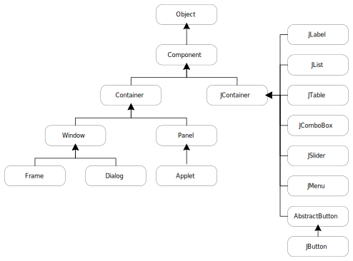

= R1. Java Graphics(swing)

**Keyword**

* GUI
* swing
* delegation
* event-driven programming

== R1-1. Component class

Java Swing에서는 아래와 같은 component를 지원한다.

게임에서 필요한 몇 가지 component에 대해 알아보자.

=== R1-1-1. JLabel class

* 화면상에 문자열 출력
* 색, 크기, 폰트 등 지정 가능

=== R1-1-2. JTextField class

* 화면상에 문자열 입력을 위한 입력창 생성
* 입력 글자 수, 형식  등 지정 가능

=== R1-1-3. JBotton class

* 흔히 알고 있는 push 버튼
* 상태

=== R1-1-4. JToggleButton class

* 두 가지 상태 중 하나의 상태를 가지고 있는 버튼

=== R1-1-5. JSlider class

* 제한된 간격 내에서 손잡이를 밀어 사용자가 값 선택
* 옵션으로 눈금 표시

== R1-2. Container class

컨테이너 class는 다양한 컴포넌트를 담아서 하나의 컴포넌트처럼 관리할 수 있도록 지원하는 class이다.

* TextField, Label 등과 같은 다른 구성 요소를 포함할 수 있는 awt 구성 요소이다
* Frame, Dialog, Panel class가 여기에 속한다.
* 구성 요소를 특정 위치에 배치되는 화면으로써, 구성 요소의 레이아웃을 포함하고 제어한다.

컨테이너의 4가지 유형은 다음과 같다.

* Window
** 테두리와 메뉴 표시줄이 없다
* Panel
** 제목 표시줄, 테두리 또는 메뉴 표시줄을 포함하지 않는다.
** Button, TextField 등의 다른 구성 요소들을 배치하기 위한 용도로 사용된다.

* Frame
** 제목 표시줄, 테두리 또는 메뉴 표시줄을 포함하지 않는다.
** Button, TextField 등의 다른 구성 요소들을 배치하기 위한 용도로 사용된다.

* Dialog

=== R1-2-1. Layout

AWT에서는 컨테이너 안에서 구성 요소들의 위치를 자동으로 지정해 주는 다양한 layout을 지원한다.

Layout의 종류는 다음과 같다.

* BorderLayout
* FlowLayout
* GridLayout
* GridBagLayout
* BoxLayout
* CardLayout
* GroupLayout
* SpringLayout

몇 가지 layout에 대해 알아보자.

{empty} +

==== R1-2-1-1. BorderLayout

* Frame 기본 layout
* 구성 요소를 container 상/하/좌/우/중앙에 위치

==== 문제 39. Frame의 layout을 BorderLayout으로 설정하고 버튼을 추가해 보자

다음 코드는 버튼을 Frame의 동쪽에 붙이는 코드이다.

[source,java]
----
----

결과는 다음과 같다.

image::./image/figure38.png"[title="image-BorderLayout",align=center]

==== R1-2-1-2. GridBagLayout

* Container 내부를 행과 열로 구분
* 구성 요소를 행과 열을 지정하여 배치
* 구성 요소  크기 지정 가능

==== 예제. GridBagLayout을 이용해 다음과 같이 구성하라

image::./image/figure39.png"[title="exam_11_3_1_2_1_1",align=center]

각 버튼의 속성을 보면 아래와 같다.

[cols="1,1,1,1,1,1", frame=none,grid=none]
|===
^s| Button  ^s| 가로 위치 ^s| 세로 위치 ^s| 폭 가중치 ^s| 가로 격자수 ^s| 높이 
^| 1 ^|     0     ^|     0     ^|           ^|              ^|      
^| 2 ^|     1     ^|     0     ^|    0.5    ^|              ^|      
^| 3 ^|     2     ^|     0     ^|    0.5    ^|              ^|      
^| 4 ^|     3     ^|     0     ^|    0.5    ^|              ^|      
^| 5 ^|     1     ^|     1     ^|    0.5    ^|      2       ^|  40  
|===

**예제 코드**

[source,java]
----
import java.awt.*;
import javax.swing.*;

public class Exam_11_3_1_2_1 {
    /**
     * @param args
     * @throws InterruptedException
     */
    public static void main(String[] args) throws InterruptedException {
        JFrame frame = new JFrame();
        GridBagConstraints constraints = new GridBagConstraints();
        constraints.fill = GridBagConstraints.HORIZONTAL;
        // 제목 설정
        frame.setTitle("GridBagLayout");
        //// 크기 설정
        frame.setSize(400, 130);
        //
        frame.setLayout(new GridBagLayout());

        JButton button = new JButton("Button 1");
        constraints.gridx = 0;
        constraints.gridy = 0;
        frame.add(button, constraints);

        button = new JButton("Button 2");
        constraints.weightx = 0.5;
        constraints.gridx = 1;
        constraints.gridy = 0;
        frame.add(button, constraints);

        button = new JButton("Button 3");
        constraints.weightx = 0.5;
        constraints.gridx = 2;
        constraints.gridy = 0;
        frame.add(button, constraints);

        button = new JButton("Button 4");
        constraints.weightx = 0.5;
        constraints.gridx = 3;
        constraints.gridy = 0;
        frame.add(button, constraints);

        button = new JButton("Button 5");
        constraints.weightx = 0.5;
        constraints.gridx = 1;
        constraints.gridwidth = 2;
        constraints.gridy = 1;
        constraints.ipady = 40;
        frame.add(button, constraints);

        frame.setVisible(true);
    }
}
----

==== 문제 40. 계산기 만들기

* 아래 그림과 같은 계산기를 구성한다.
* 버튼
** 0~9 숫자(0, 1, 2, 3, 4, 5, 6, 7, 8, 9)
** 사칙 연산자(+, -, *, /)
** 초기화(AC)
** 계산(=)

image::./image/figure40.png"[title="계산기",align=center]

==== R1-2-1-3. AbsoluteLayout

* 절대 좌표를 이용한 구성요소 배치
** SetBounds
** 자동 배치가 되지 않아 원하는 구성이 나오지 않을 수 있음
* LayoutManager 없음
** setLayout(null)

==== 문제. 계산기를 AbsoluteLayout을 이용해 구성해 보자

**Keyword**

* GUI
* AWT, Swing
* Delegation

* Event-Driven Programming

== R1-1. Component class

Java Swing에서는 아래와 같은 component를 지원한다.

[source,mermaid]
----
classDiagram
    Object <|-- Component
  Component <|-- Container
  Container <|-- Window
  Window <|-- Frame
  Window <|-- Dialog
    Frame <|-- JFrame
    Dialog <|-- JDialog
    Container <|-- JComponent
    JComponent <|-- Button
    JComponent <|-- JLabel
    JComponent <|-- JCheckbox
    JComponent <|-- JList
    JComponent <|-- JProgressBar
    JComponent <|-- AbstractButton
    AbstractButton <|-- JButton
    AbstractButton <|-- JToggleButton
    JToggleButton <|-- JCheckBox
----

게임에서 필요한 몇 가지 component에 대해 알아보자.

=== R1-1-1. JLabel class

* 화면상에 문자열 출력
* 색, 크기, 폰트 등 지정 가능

=== R1-1-2. JTextField class

* 화면상에 문자열 입력을 위한 입력창 생성
* 입력 글자 수, 형식  등 지정 가능

=== R1-1-3. JBotton class

* 흔히 알고 있는 push 버튼
* 상태

=== R1-1-4. JToggleButton class

* 두 가지 상태 중 하나의 상태를 가지고 있는 버튼

=== R1-1-5. JSlider class

* 제한된 간격 내에서 손잡이를 밀어 사용자가 값 선택
* 옵션으로 눈금 표시

== R1-2. Container class

컨테이너 class는 다양한 컴포넌트를 담아서 하나의 컴포넌트처럼 관리할 수 있도록 지원하는 class이다.

* TextField, Label 등과 같은 다른 구성 요소를 포함할 수 있는 awt 구성 요소이다
* Frame, Dialog, Panel class가 여기에 속한다.
* 구성 요소를 특정 위치에 배치되는 화면으로써, 구성 요소의 레이아웃을 포함하고 제어한다.

컨테이너의 4가지 유형은 다음과 같다.

* Window
** 테두리와 메뉴 표시줄이 없다
* Panel
** 제목 표시줄, 테두리 또는 메뉴 표시줄을 포함하지 않는다.
** Button, TextField 등의 다른 구성 요소들을 배치하기 위한 용도로 사용된다.

* Frame
** 제목 표시줄, 테두리 또는 메뉴 표시줄을 포함하지 않는다.
** Button, TextField 등의 다른 구성 요소들을 배치하기 위한 용도로 사용된다.

* Dialog

=== R1-2-1. Layout

AWT에서는 컨테이너 안에서 구성 요소들의 위치를 자동으로 지정해 주는 다양한 layout을 지원한다.

Layout의 종류는 다음과 같다.

* BorderLayout
* FlowLayout
* GridLayout
* GridBagLayout
* BoxLayout
* CardLayout
* GroupLayout
* SpringLayout

몇 가지 layout에 대해 알아보자.

{empty} +

==== R1-2-1-1. BorderLayout

* Frame 기본 layout
* 구성 요소를 container 상/하/좌/우/중앙에 위치

==== 문제 39. Frame의 layout을 BorderLayout으로 설정하고 버튼을 추가해 보자

다음 코드는 버튼을 Frame의 동쪽에 붙이는 코드이다.

[source,java]
----
----

결과는 다음과 같다.

image::./image/figure38.png"[title="image-BorderLayout",align=center]

==== R1-2-1-2. GridBagLayout

* Container 내부를 행과 열로 구분
* 구성 요소를 행과 열을 지정하여 배치
* 구성 요소  크기 지정 가능

==== 예제. GridBagLayout을 이용해 다음과 같이 구성하라

image::./image/figure39.png"[title="exam_11_3_1_2_1_1",align=center]

각 버튼의 속성을 보면 아래와 같다.

[cols="1,1,1,1,1,1", frame=none,grid=none]
|===
^s| Button  ^s| 가로 위치 ^s| 세로 위치 ^s| 폭 가중치 ^s| 가로 격자수 ^s| 높이 
^| 1 ^|     0     ^|     0     ^|           ^|              ^|      
^| 2 ^|     1     ^|     0     ^|    0.5    ^|              ^|      
^| 3 ^|     2     ^|     0     ^|    0.5    ^|              ^|      
^| 4 ^|     3     ^|     0     ^|    0.5    ^|              ^|      
^| 5 ^|     1     ^|     1     ^|    0.5    ^|      2       ^|  40  
|===

**예제 코드**

[source,java]
----
import java.awt.*;
import javax.swing.*;

public class Exam_11_3_1_2_1 {
    /**
     * @param args
     * @throws InterruptedException
     */
    public static void main(String[] args) throws InterruptedException {
        JFrame frame = new JFrame();
        GridBagConstraints constraints = new GridBagConstraints();
        constraints.fill = GridBagConstraints.HORIZONTAL;
        // 제목 설정
        frame.setTitle("GridBagLayout");
        //// 크기 설정
        frame.setSize(400, 130);
        //
        frame.setLayout(new GridBagLayout());

        JButton button = new JButton("Button 1");
        constraints.gridx = 0;
        constraints.gridy = 0;
        frame.add(button, constraints);

        button = new JButton("Button 2");
        constraints.weightx = 0.5;
        constraints.gridx = 1;
        constraints.gridy = 0;
        frame.add(button, constraints);

        button = new JButton("Button 3");
        constraints.weightx = 0.5;
        constraints.gridx = 2;
        constraints.gridy = 0;
        frame.add(button, constraints);

        button = new JButton("Button 4");
        constraints.weightx = 0.5;
        constraints.gridx = 3;
        constraints.gridy = 0;
        frame.add(button, constraints);

        button = new JButton("Button 5");
        constraints.weightx = 0.5;
        constraints.gridx = 1;
        constraints.gridwidth = 2;
        constraints.gridy = 1;
        constraints.ipady = 40;
        frame.add(button, constraints);

        frame.setVisible(true);
    }
}
----

==== 문제 40. 계산기 만들기

* 아래 그림과 같은 계산기를 구성한다.
* 버튼
** 0~9 숫자(0, 1, 2, 3, 4, 5, 6, 7, 8, 9)
** 사칙 연산자(+, -, *, /)
** 초기화(AC)
** 계산(=)

image::./image/figure40.png"[title="계산기",align=center]

==== R1-2-1-3. AbsoluteLayout

* 절대 좌표를 이용한 구성요소 배치
** SetBounds
** 자동 배치가 되지 않아 원하는 구성이 나오지 않을 수 있음
* LayoutManager 없음
** setLayout(null)

==== 문제. 계산기를 AbsoluteLayout을 이용해 구성해 보자
