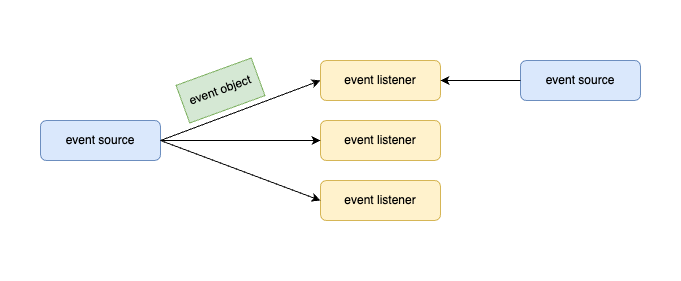
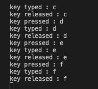

= R2. Event-Driven Programming

**Keyword**

* https://docs.oracle.com/javase/tutorial/uiswing/events/intro.html[Event Listener]

== R2-1. Java Event

Java는 delegation event model(델리게이션 이벤트 모델)을 사용하여 이벤트를 처리한다. 이 모델은 이벤트를 생성하고 처리하는 표준 메커니즘으로 정의되고 다음과 같은 요소들로 구성된다.

* Event Object(이벤트 오브젝트)
** 이벤트가 발생 시 해당 이벤트를 식별할 수 있는 각종 묶음 정보
** 이벤트 발생으로 생성되고, 이벤트 처리에 이용된다.
** 이벤트 오브젝트에 대한 class를 제공하거나 용도에 맞게 정의되어야 한다.
* Event Source(이벤트 소스)
** 소스는 이벤트가 발생하는 오브젝트
** 발생한 이벤트에 대한 정보를 핸들러에 제공할 책임이 있다
** Java는 소스 오브젝트에 대한 class를 제공한다.
* Event Listener(이벤트 리스너)
** 이벤트에 대한 응답을 생성
** 인터페이스 제공
** 구현을 통한 실체화로 이벤트 핸들러 생성
** 이벤트를 수신할 때까지 기다리다 이벤트가 수신되면, 인터페이스를 이용해 구현된 함수를 통해 이벤트 처리
** 인터페이스를 이용해 구현된 오브젝트를 이벤트 핸들러(**Event Handler**)라고도 한다.

이러한 접근 방식의 이점은 사용자 인터페이스와 이벤트 생성을 완전히 분리된다는 것이고, 사용자 인터페이스는 이벤트 처리를 별도의 코드로 위임할 수 있다.

이 모델에서는 listener가 이벤트 알림을 수신할 수 있도록 listener를 소스 오브젝트에 등록해야 한다. 이벤트 알림을 수신하려는 listener에만 이벤트 알림이 전송되기 때문에 이는 이벤트를 처리하는 효율적인 방법이다.

**이벤트 오브젝트(Event Object)**

이벤트란 개체의 상태 변화를 말한다.  즉, 이벤트는 이벤트 소스의 상태 변화를 설명합니다.

이벤트는 그래픽 사용자 인터페이스 구성 요소와의 사용자 상호 작용의 결과로 생성된다. 예를 들어 버튼 클릭, 마우스 이동, 키보드로 문자 입력, 목록에서 항목 선택, 페이지 스크롤 등이 이벤트를 발생시키는 활동이다.

Java AWT와 swing에서 구현된 이벤트의 종류들에는 아래와 같은 이벤트들이 지원된다.

**Java AWT와 swing에서의 이벤트 종류**

[cols="1,5"]
|===
^s| 이벤트          ^s| 발생 상황
^s| ActionEvent     | 오브젝트의 상태 변화, 즉, 클릭, 메뉴 선택, 입력 완료 등 사용자의 행동과 관련된 이벤트
^s| ItemEvent       | 오브젝트에 포함된 여러 개의 아이템 중 하나 이상이 선택될 경우 발생하는 이벤트 
^s| KeyEvent        | 키보드 키 입력
^s| MouseEvent      | 마우스 커서의 이동이나 버튼의 상태 변화가 발생할 경우
^s| FocusEvent      | 컴포넌트가 선택되거나 해제된 경우
^s| TextEvent       | 텍스트가 변경될 때
^s| WindowEvent     | Window를 상속받는 모든 컴포넌트에 대해 window 활성화, 비활성화 등
^s| AdjustmentEvent | 스크롤바를 움직일 때
^s| ComponentEvent  | 컴포넌트가 사라지거나 이동, 크기 변경
^s| ContainerEvent  | 컨테이너에 컴포넌트의 추가/삭제
|===
**이벤트 소스(Event Source)**

이벤트 소스랑 이벤트를 발생시키는 오브젝트를 말한다. 즉, 화면을 구성하거나 특정한 기능을 수행하는 오브젝트로서 외부적인 요인이나 특정 조건 등이 만족할 때 해당 이벤트를 생성한다.

Java AWT와 swing에서는 이벤트 소스에 이벤트 listener를 등록하여 이벤트 발생 시 처리할 수 있도록 지원한다.

**Java AWT와 swing에서의 이벤트 소스와 이벤트**

[cols="1,1,2"]
|===
^s| 이벤트 소스       ^s| 이벤트          ^s| 발생 상황 
| Container         | ContainerEvent  | 컨테이너에 컴포넌트의 추가/삭제
| Component         | ComponentEvent  | 컴포넌트가 사라지거나 이동, 크기 변경
|                   | FocusEvent      | 컴포넌트가 포커스를 받거나 잃을 때
|                   | KeyEvent        | 키를 누르거나 뗄 때
|                   | MouseEvent      | 마우스 버튼을 누르거나 뗄 때, 마우스 버튼을 클릭할 때, 컴포넌트 위에 마우스가 올라갈 때 등..
| Window            | WindowEvent     | Window를 상속받는 모든 컴포넌트에 대해 window 활성화, 비활성화 등
| JButton           | ActionEvent     | 마우스로 버튼 클릭
| JList             | ActionEvent     | 아이템을 더블클릭하여 리스트 아이템 선택 
| JMenuItem         | ActionEvent     | 특정 메뉴의 선택
| JTextField        | ActionEvent     | 텍스트를 입력한 후 엔터키 입력
| JCheckBox         | ItemEvent       | 체크박스의 선택/해제
| JCheckBoxMenuItem | ItemEvent       | 체크박스 메뉴아이템의 선택/해제
| JList             | ItemEvent       | 리스트 아이템 선택
| JScrollBar        | AdjustmentEvent | 스크롤바를 움직일 때
|===

**Event Listener**

이벤트가 발생했을 때 그 처리를 담당하는 오브젝트를 가리키며, 해당 오브젝트에서 이벤트를 처리하는 함수를 event handler라고도 한다.

Java에서는 인터페이스를 이용해 event listener의 기본 형태를 정의하고 있으며, 개별 응용에 따라 해당 인터페이스를 class로 구현하여 이벤트를 처리할 수 있도록 한다.

**Event Listener Interface**

event listener interface는 이벤트 소스에서 이벤트가 발생할 경우, 이에 대한 처리를 등록하기 위한 인터페이스로서 각각의 이벤트별로 정의되어 있다. 이벤트 소스에서는 이벤트가 발생하면 등록된 event listener의 정해진 함수를 호출하여 처리하게 되므로, 해당 이벤트 소스로부터 이벤트를 받아 처리하고자 할 경우에는 해당 이벤트의 event listener interface를 이용해 구현 후 등록하면 된다.

Java에서 유효한 event listener interface는 아래와 같은 종류들이 있다.

**Java AWT와 swing 이벤트와 event listener interface**

[cols="1,1,4"]
|===
^s| Evnet ^s| Event Listener Interface ^s| 설명
| ActionEvent    | ActionListener           | 버튼 클릭이나 텍스트 필드 변경 등의 작업에 응답한다.
| ItemEvent      | ItemListener             | 개별 항목 변경 사항을 수신한다.(예: checkbox)
| KeyEvent       | KeyListener              | 키보드 입력을 수신한다. 
| MouseEvent     | MouseListener            | 마우스에서  발생하는 이벤트를 수신한다(예 : 클릭, 더블 클릭, 오른쪽 클릭 등)
|                | MouseMotionListener      | 마우스 움직임을 수신한다.
| FocusEvent     | FocusListener            | component가 포커스를 받거나 잃을 때 수신한다.
| WindowEvent    | WindowListener           | window에서 발생하는 이벤트를 수신한다.
| ContainerEvent | ContainerListener        | 컨테이너에서 발생하는 이벤트를 수신한다.(예 : JFrame, JPanel 등)
| ComponentEvent | ComponentListener        | 구성 요소의 변경 사항을 수신한다. (예 : 레이블 이동, 크기 조정 등)
| AdustmentEvent | AdjustmentListener       | 조정을 수신한다. (예 : 스크롤바 작동)
|===

==== 문제 41. 계산기 만들기

* 간단한 정수 계산기를 만든다.
* AC를 누르면 초기화된다.
* 피연산자가 입력된 상태에서 연산자를 누르면 계산된다.
** 피연산자, 연산자, 피연산자가 입력된 상태일 때, 연산자를 누르면 계산 후 피연산자, 연산자 표시된다.
** 피연산자 하나만 있으면, 피연산자, 연산자로 표시된다.
** 피연산자 입력 시에는 피연산자만 보인다.

image::./image/figure40.png"[title="계산기",align=center]

==== 문제 42. 프레임에서 키보드 사용으로 인해 발생하는 KeyEvent를 처리하라

* 프레임을 생성한다
* 프레임에서 발생하는 KeyEvent 처리를 위한 KeyListener를 등록한다
* KeyListener에서 필요한 이벤트 핸들러는 아래와 같다
** keyPressed(KeyEvent e)
** keyReleased(KeyEvent e)
** keyTyped(KeyEvent e)
* Event handler에서는 이벤트 발생 시 화면에 키값을 출력한다

**실행 결과**

==== 문제 43. KeyEvent 사용 시 문제점을 해결하라

* KeyEvent 처리를 위해 KeyListener를 등록하고 키를 누르고 있는 경우, keyPressed와 keyTyped가 반복적으로 호출된다.
* 해당 키를 반복적으로 입력하기 위해 누르고 있는 경우라면 의도에 맞게 처리될 수 있지만, 키를 누르는 순간을 검출하기에는 부족한 면이 있다.
* keyPressed는 키를 누르는 순간 1회만 발생하도록 수정하라.

==== 문제 44.  반투명 프레임을 만들고, 슬라이드를 이용해 반투명도 제어하기

* setOpacity(float f)를 이용해 프레임의 불투명도 설정 가능. 단, 불투명도 제어를 위한 조건이 만족하여야 한다.
* 불투명도는 0 ~ 100으로 설정할 수 있으며, 100이 가장 불투명한 상태이다.
* 불투명도가 변경되면, 해당 값을 아래에 출력한다.

**참고**

* setPaintTicks(boolean b) : 눈금 표시
* setPaintLabels(boolean b) : 수치 레이블 표시
* setMajorTickSpacing(int n) : 큰 눈금 간격
* setMinorTickSpacing(int n) : 작은 눈금 간격
* addChangeListener(ChangeListener l) : Event listener 설정

**실행 결과**

image::./image/figure42.png"[title="Opacity01",align=center]

**샘플 코드**

[source,java]
----
import javax.swing.*;
import javax.swing.event.*;

class OpacityFrameEx1 extends JFrame implements ChangeListener {
    JSlider slider;
    JLabel label;

    public OpacityFrameEx1() {
        // 불투명도 설정 슬라이드 (0 ~ 100)
        this.slider = new JSlider(0, 100, 100);
        // 값 출력용 레이블
        this.label = new JLabel();

        // 프레임 크기 설정
        this.setSize(300, 100);

        // 슬라이드에 트랙, 틱,  표시
        this.slider.setPaintTrack(true);
        this.slider.setPaintTicks(true);
        this.slider.setPaintLabels(true);

        // 슬라이드 눈금을 표시(작은 눈금 5, 큰 눈금 20)
        this.slider.setMajorTickSpacing(20);
        this.slider.setMinorTickSpacing(5);

        // 슬라이드값이 변경될 때마다 호
        this.slider.addChangeListener(this);

        // 패널 구성
        JPanel panel = new JPanel();
        panel.add(this.slider);
        panel.add(this.label);

        this.add(panel);

        // 초기 표시
        this.stateChanged(null);
    }

    @Override
    public void stateChanged(ChangeEvent e) {
        // 불투명도 출력
        this.label.setText("Opacity value is =" + this.slider.getValue());
        // 불투명도 설정
        this.setOpacity(this.slider.getValue() * 0.01f);
    }

    // main class
    public static void main(String[] args)
    {
        OpacityFrameEx1 frame = new OpacityFrameEx1();

        // 프레임을 불투명도로 제어하기 위해서는 타이틀바 등의 장식이 없어야 한다.
        frame.setUndecorated(true);

        // 타이틀바가 없어 이동할 수 없음. 생성 시 특정 위치에 생성
        frame.setLocation(500, 300);

        // 화면 출력
        frame.setVisible(true);
    }
}
----

== R2-2. 사용자 정의 이벤트